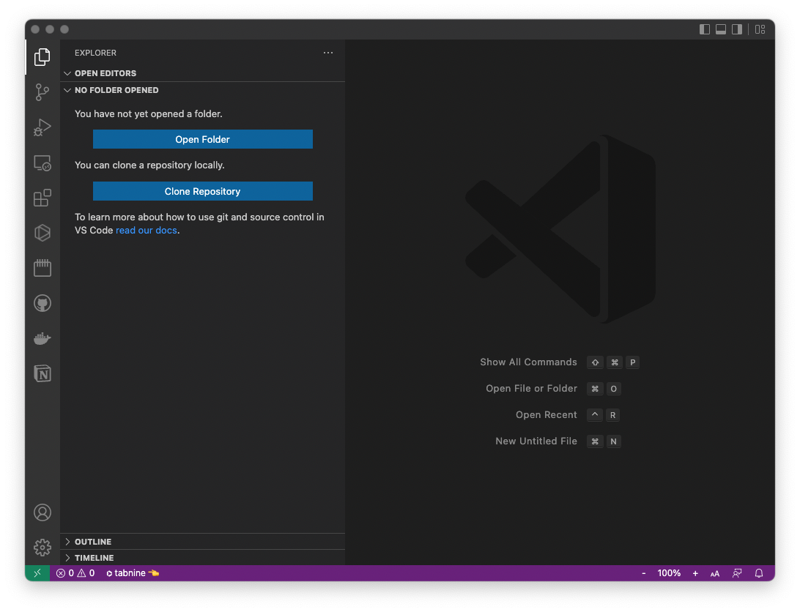
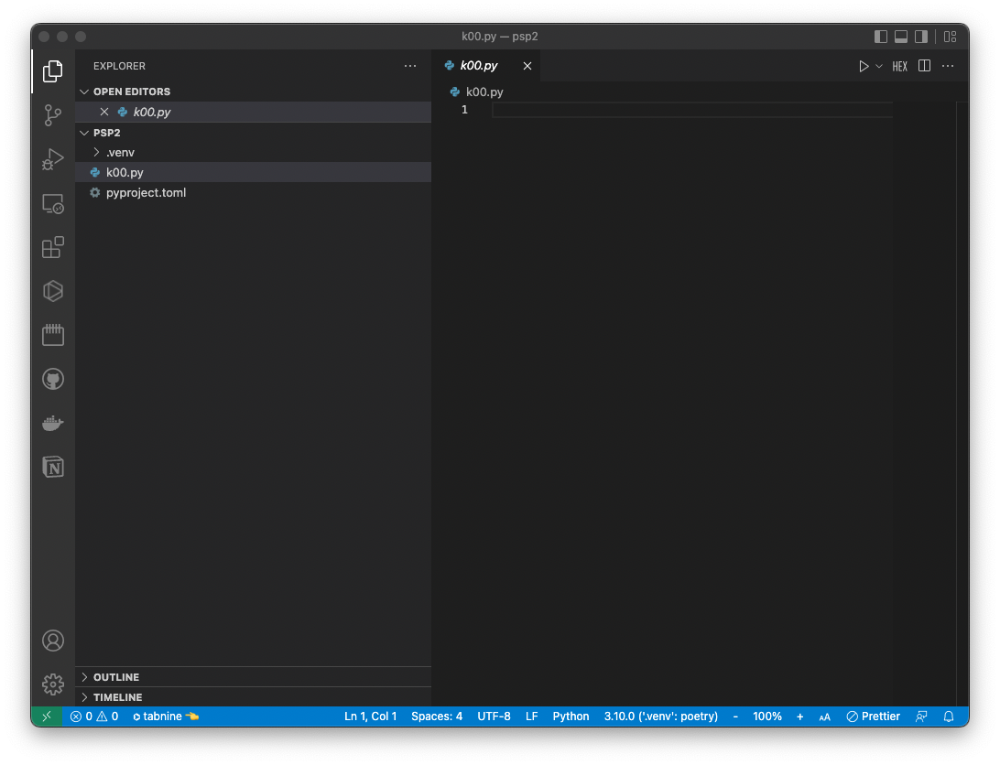
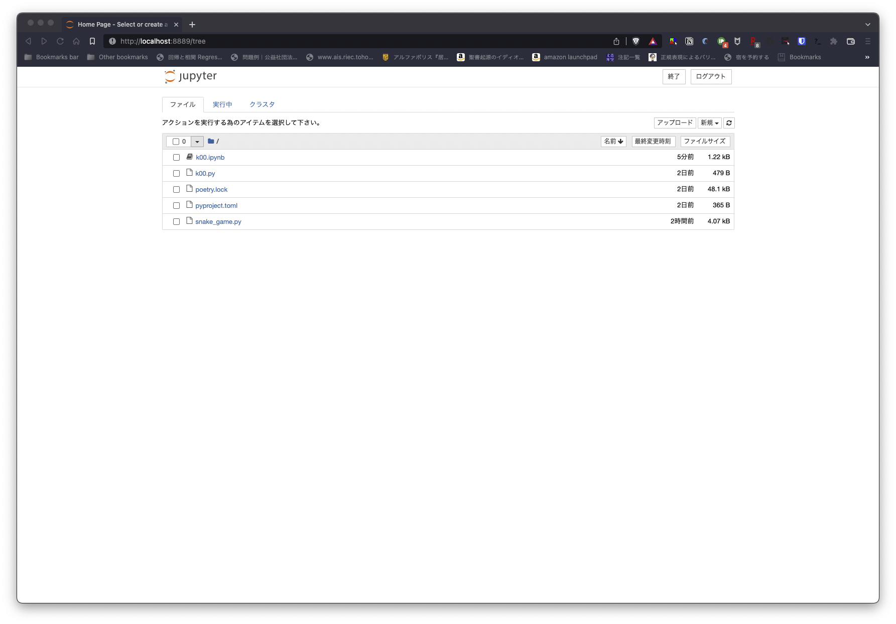
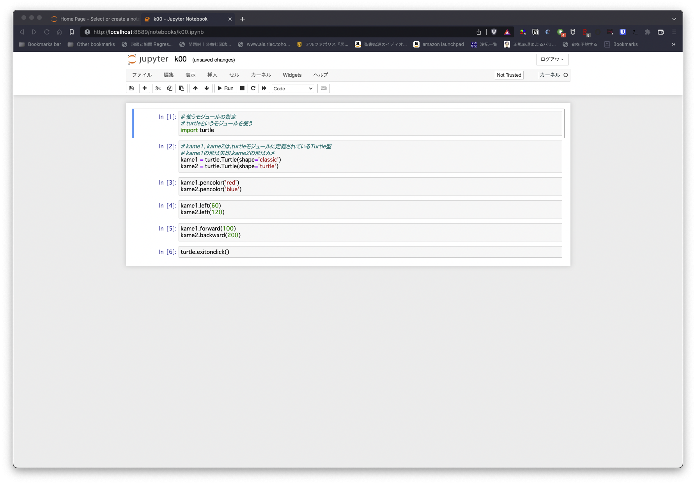

# day02: vscodeでプログラミング

## 1. 早速やってみよう

python, vscode, poetryのインストールが終わったら, 「プログラミング演習Ⅱ」用の準備をします．

1. 「ドキュメント」の下に，`psp2`というフォルダを作ります．今後は，このフォルダの下にいろいろ課題に対するソースコードやいろいろを置いていきます．
2. その`psp2`というフォルダの下に移動します．

```{.sh}
> cd c:\Users\kotaro\Documents\psp2
```

3. そこで，pythonプログラミングの準備をします．

```{.sh}
> poetry config virtualenvs.in-project true
> poetry init
```

いろいろ聞かれます．よく読んで答えましょう．基本的にはすべて提示されたままでいいですが，Authorについては，`Kotaro Sonoda <aa83988848@ms.nagasaki-u.ac.jp>`などと，「`自分の名前 スペース 三角カッコ
 メールアドレス 三角カッコ閉じ`」にしましょう．

続けて，vscodeでのプログラミングを便利にするために，`ipykernel`というpythonモデュールをインストールします．

```{.sh}
> poetry add ipykernel
```

続けて，

```{.sh}
> poetry shell
```

と打つと，「仮想環境」という独立した環境が構成されます．

macやlinuxならば`>`という「プロンプト」が`(.venv)>`に変わりますが，Windows版にはバグがあり，いつもどおりのプロンプトが追加されるだけのようです．

とりあえず今は仮想環境から脱出しておきます．

```{.sh}
(.venv)> exit
```

一旦仮想環境が作られれば，次回から仮想環境に入るときには，macやlinuxなら`poetry shell`では入れますが，windowsの場合は，

```{.sh}
> .\.venv\Scripts\Activate.bat
```

PowerShellの場合は，

```{.sh}
PS1 > .\.venv\Scripts\Activate.ps1
```

で入ることができます．この場合プロンプトが`(.venv)`となります．

## 2. それでは今日の課題をやっていきましょう．

vscodeを起動します．


左端にあるアイコンは，メニューです．一番下にある帯には，現在開いているファイルに関する「状態」が表示されています．

ウィンドウのほとんどの部分は，エディタです．「ファイル名　x」という感じで，最近のウェブブラウザのように「タブ」が並びます．

初期起動時には，「Get Started」というタブが立ち上がっています．使わないので「x」を押して消してください．

一番上にあるアイコンを押してください．これは「エクスプローラ」と呼ばれています．



`OPEN EDITORS`には，現在開いているエディタで編集しているファイル名が並びます．先ほどタブを閉じたので何もありません．

その下には`NO FOLDER OPENED`と表示され，何やら青いボタンが並んでいます．

説明したように，「ファイルを開く」のではなく，「フォルダを開く」というボタンです．ちなみに下のボタン「Clone Repository」は「レポジトリ」と呼ばれる特殊なフォルダを開くボタンです．

さきほど作った`psp2`フォルダを開きます．


「`NO FOLDER OPENED`」の表示が「`psp2`」に変わり，

```{.sh}
v PSP2
  > .venv
  pyproject.toml
```

と表示されていると思います．

「`PSP2`」のあたりにマウスを移動させると，その帯の右側に4つのアイコンが並びます．それぞれのアイコンにマウスを移動させると説明が表示されますが，左から，「ファイルを追加」「フォルダを追加」「更新」「表示を縮める」です．

なにかプログラミングしてみましょう．

「ファイル追加」アイコンを押して，「`k00.py`」という名前のファイルを新しく作ってみます．



「OPENED EDITORS」に`k00.py`が列挙され，`k00.py`というタブが開きます．

そこに以下のようなコードを書きましょう．

```{.py}
# coding:utf-8

# %%
# 使うモジュールの指定
# turtleというモジュールを使う
import turtle

# %%
turtle.setup(width=300, height=300)

# %%
# kame1, kame2は，turtleモジュールに定義されているTurtle型
# kame1の形は矢印，kame2の形はカメ
kame1 = turtle.Turtle(shape='arrow')
kame2 = turtle.Turtle(shape='turtle')

# %%
kame1.pencolor('red')
kame2.pencolor('blue')

# %%
kame1.penup()
kame1.goto(50,50)

kame2.penup()
kame2.goto(-50,50)

kame1.pendown()
kame2.pendown()

# %%
kame1.left(60)
kame2.left(120)

# %%
kame1.forward(100)
kame2.backward(200)

# %%
turtle.exitonclick()

# %%
```

- 「`#`」記号のある行はいわゆるコメントアウトで，pythonの実行コードから無視されます．
- コメントアウト，文字列，など色分けされていますね．
- 最初の行のコメントアウト「`# coding:utf-8`」は，このソースコードの日本語が文字コード「`utf-8`」で書かれていることをIDEに教えています．Windowsの場合は文字コードが「`shift-jis`」かもしれません．

また，このソースコードをvscodeで書くと，
「`# %%`」と書かれた部分の上に，

```{.sh}
「Run Cell | Run Below | Debug Cell」
------------------------------------------
# %%
```

という表示が見えます．この部分は実際のソースコードを勝手にいじったわけではありません．vscodeがただ見せているだけです．
これについては，あとで説明します．

では，この`k00.py`を実行しましょう．

vscodeとは別に，コマンドプロンプトを立ち上げて，

```{.sh}
> cd c:\Users\kotaro\Documents\psp2
```

で`psp2`フォルダに移動し，

```{.sh}
> python k00.py
```

とすればプログラムが動きます．

これでもいいのですが，vscodeはウィンドウの中でコマンドプロンプトを起動できます．上部メニューに「ターミナル」があり，そこに「新しいターミナルを開く」というのがあります．


「(.venv)」プロンプトのコマンドプロンプトがエディタの下の領域に立ち上がります．フォルダも現在作業中の場所に移動しています．ここで

```{.sh}
(.venv) > python k00.py
```

でよいでしょう．

**で，このソースコードは，どんなプログラムでしょうか？**

ざっくり言うと，新しくウインドウが立ち上がって，矢印とカメがそれぞれ線を描きながら動いて停止します．ちなみに，ウインドウが立ち上がったままですが，ウインドウ内のどこかでクリックすると，ウインドウが閉じます．

というわけで，今日の課題

> (1)`k00.py`のそれぞれの行で行われていることを調べて，ソースコードにそれぞれの行で行われていることをコメントアウトに追記せよ．

> (2)正六角形を描画するソースコード`k00_hexagon.py`を作成せよ．ただし，左半分は矢印で赤，右半分はカメで青で描くこと．for文もしくはwhile文などの繰り返し処理を用いること．自分で編集したソースコードのそれぞれの行で行われていることをコメントアウトに追加せよ．

> (3)`k00_pentagon.py`に正N角形を描画する関数`NsidePolygon(n)`を作成し，`NsidePolygon`関数を利用して正五角形を描け．ただし，関数`NsidePolygon(n)`は`n`匹のカメを発生させ，それぞれのカメが一つの辺のみを描画することとする．繰り返し処理を利用してできるだけ行数を短くせよ．

> ~(4)`k00_pentagon.py`を`k00_invalid.py`にコピーし，正三角形未満，nが2以下のときでもワーニングやエラーでプログラムが半端に止まらないよう例外処理を加えよ．~

> (4改)`k00_pentagon.py`を`k00_invalid.py`にコピーし，描く線の色名を指定して正五角形を描け．`pencolor('yellow')`で黄色に，`pencolor('blue')`で青色の線を指定できる．ただし，適当な文字列を色名とするとエラーが出てプログラムが止まるであろう．適当な色名が指定されたときには`pencolor('black')`で線を黒色に指定しなおすように，例外処理を加えよ．

> (5) フォルダ`k00funcs`を作り，その下に`k00_func.py`を作成せよ．(4)の関数`NsidePolygon`関数を`k00_func.py`に書き，`k00_octagon.py`で`from k00funcs import k00_func`として読み込んだ上で，`NsidePolygon`関数を利用して，正八角形を描け．

課題は，

- LACSの課題から，ソースコードと描画されたウィンドウのスクリーンショットを提出してください．
- 初めての提出作業は**4月27日正午まで**に必ず行ってください．**この期限以降は再提出以外は受け付けません．** 課題提出があると，TAや私がそれを採点し，改善点があればコメントを残します．
- コメントを踏まえて再度提出し，10点満点を目指し何度でも提出を受付ます．課題k00の最終期限は**5月11日正午まで**とします．**この期限以降は再提出はできません．**
- 今後の課題も，基本的には，初めての提出の期限を1週間後，最終期限を2週間後とします．

## 3. 便利なvscode用コメントアウト　「`# %%`」

ソースコードは基本的には，`python k00.py`だと最初の行から最後の行まですべての工程を行います．

コードのそれぞれの行で何を行っているか調べるなら，もしくは新しく文を書いて，その動きを確かめたいのなら，pythonだとIPythonが有名です．IPythonは，JupyterやGoogle Colabを動かしているプログラムです．

ターミナルやコマンドプロンプトで，`ipython`と打つと，

```{.sh}
(.venv) kotaro@calvados psp2 % ARM❯ ipython                                [04/12 21:31]
Python 3.10.0 (default, Jan 13 2022, 14:22:16) [Clang 13.0.0 (clang-1300.0.29.30)]
Type 'copyright', 'credits' or 'license' for more information
IPython 8.2.0 -- An enhanced Interactive Python. Type '?' for help.
Unable to automatically import mitosheet

In [1]: 
```

のように，インタラクティブモードが立ち上がります．

```{.sh}
In [1]: x = 10

In [2]: print(x)
10
```

のように，JupyterやGoogle Colabと何ら変わりません．

ただ，問題なのは，このインタラクティブモードで書いたソースコードは保存されないということ．JupyterやGoogle Colabで書いたものも，基本的には「jupyter notebook」（拡張子は `.ipynb`）であり，pythonのソースコード(`.py`)ではないということです．

JupyterやGoogle Colabではメニューから，JupyterNotebook(`.ipynb`)からpythonソースコード(`.py`)に変換することは可能ですが，

僕らが今欲しいのは，書いているpythonソースコードをブロック毎に動きを確かめたい．そこで，vscodeの「`# %%`」です．

実は，

```{.sh}
「Run Cell | Run Below | Debug Cell」
------------------------------------------
# %%
```

は，vscode上で，pythonソースコードを簡単にインタラクティブモードで動かすコメントアウトになっているのです．凄い便利！！

「`# %%`」から次の「`# %%`」までが，IPythonの「セル」です．

- 「Run Cell」は，セルを実行する
- 「Run Below」は，以下のすべてのセルを実行する
- 「Debug Cell」は，セルをデバグする．（デバグについては後日）

また，このように書かれたpythonソースコード`.py`は，`Run Cell`や`Run Below`で隣に立ち上がったJupyterみたいなタブで`save`をすることでJupyter Notebook `.ipynb`に保存できます．ターミナルで`jupyter notebook`と打つとウェブブラウザが立ち上がり，



ここで，`.ipynb`を選択すると，jupyter Notebookを実行できます．



ちなみに，Jupyter notebookでの編集は，`.ipynb`には反映されますが，元の`.py`には反映されないので注意．

## 4.　繰り返し処理

python言語の繰り返し処理は，

```{.py}
処理文A
for 仮変数X in コンテナP:
    仮変数Xを利用できる処理文B
    仮変数Xを利用できる処理文C
処理文D
```

の形で処理文Bと処理文Cの繰り返しを実現します．

仮変数Xは繰り返しのたびに，コンテナPの先頭から1つだけ要素が代入されます．コンテナPの最後の要素が代入されたら最後の繰り返しとなり，繰り返しブロックを抜けます．

コンテナPがリストの場合，

```{.py}
L = [1, 10, 'blue', 3.14]
for i in L:
    print(i)
for j in L:
    print('i')
```

は，どのように出力されるでしょうか？やってみましょう．

コンテナPが文字列の場合は，どうなるでしょう？

```{.py}
S = 'Programing'
for i in S:
    print(i)
```

コンテナPが辞書の場合は，どうなるでしょう？

```{.py}
D = {'a':1, 'b':10, 'c':'blue', 'd':3.14}
for i in D:
    print(i)
for j in D:
    print(D[j])
```

コンテナPは，スライスでも構いません．

```{.py}
S = 'Programing'
for i in S[1:]:
    print(i)
```

コンテナPは，その場で`range`を利用することもできます．

```{.py}
for i in range(5):
    print(i)
```

`enumerate`も覚えておくとよいでしょう．何が行われるか試してみてください．

```{.py}
S = 'Programing'
for i,j in enumerate(S):
    print(f'{i}:{j}')
```

## 5.　モジュールおよび関数

関数は，次のような書き方で宣言でき，同一のファイル内であれば，宣言したあとに呼び出せます．

```{.py}
def 関数名(仮引数...):
    仮引数を利用できる処理文
    return 出力変数

y = 関数名(x)
```

別のファイルに関数が書かれている場合，呼び出し側のファイルでimportします．関数が書かれた`.py`ファイル，またはそのファイル名の`.py`を除いた文字列をモジュールと呼びます．

importの基本形は，以下の形式です．

```
from フォルダA.フォルダB import モジュールC as モジュールCの別名
```

や

```
from フォルダA.フォルダB import モジュールC, モジュールD
```

これは，下の木構造のように，呼び出し側のソースコードから見て，同じフォルダにあるフォルダAの下のフォルダBの下にあるモジュール.pyを import することを表します．

<pre>
└── フォルダX
        ├── フォルダA
        │     └── フォルダB
        │             ├── モジュールC.py
        │             └── モジュールD.py
        └── 呼び出し側のソースコード.py
</pre>

注意は，
- 「フォルダA/フォルダB」ではなく，「フォルダA.フォルダB」であること．
- importにフォルダの切れ目の「.」は使えない

呼び出し側で，関数を呼び出すときは，以下のようにします．

```{.py}
from forder1.forder2 import module
y = module.func(x)
```

のように呼び出し側のファイルでは，単に`関数名`ではなく，`モジュール.関数名`で呼び出します．

`import module as mod`のように別名を指定すれば，

```
y = mod.func(x)
```

のように別名を使うこともできます．

また，モジュールがソースコードと同じフォルダにある場合は，
`from `を省略できます．

また，ソースコードと同じフォルダの下でなくとも，pipやpoetryやcondaで入れたパッケージやモジュールはimportできます．


**混乱を生むが許されている他のimport方法**

実は他のimport方法があります．

1. モジュールをfromにして，関数をimport

呼び出し側のソースコードでも，単に関数名になります．
関数名が他でも使われている場合に混乱します．

```
from フォルダ.モジュール import func

y = func(x)
```

2. 1でさらにワイルドカードで関数をimport

importは，「,」で区切って複数のものをimportできますが，
あるモジュール内に存在するすべての関数をimportする場合，
以下のように書くことができます．
```
from モジュールA import *
from モジュールB import *

y = func(x)
```

しかし，この場合，`func`という関数が，どちらのモジュールに書かれているものなのか，ソースコードから読み取れません．どちらのモジュールにも`func`が存在する場合，後ろにあるモジュールBの`func`が利用され，混乱の元になります．


