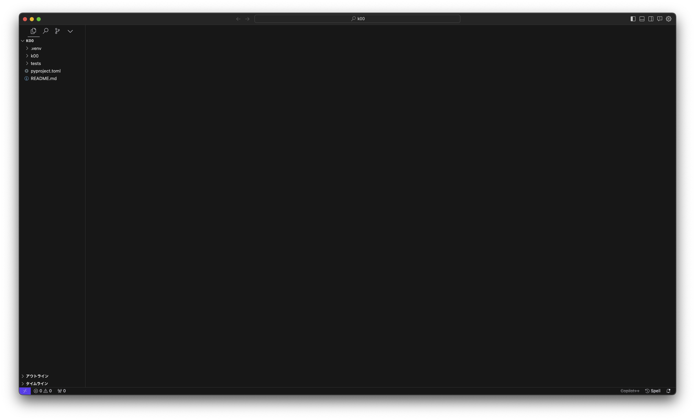
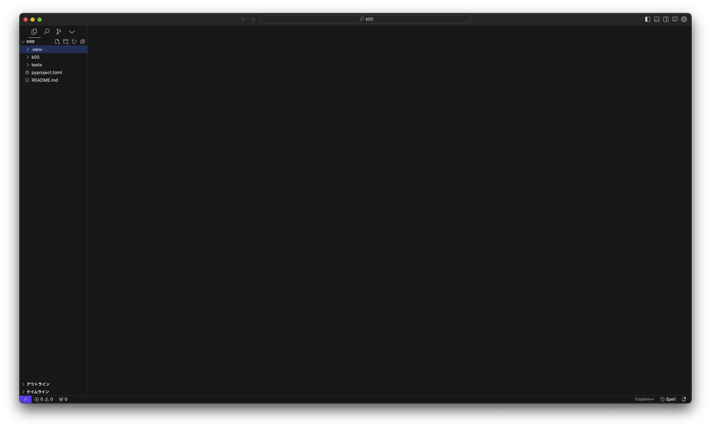
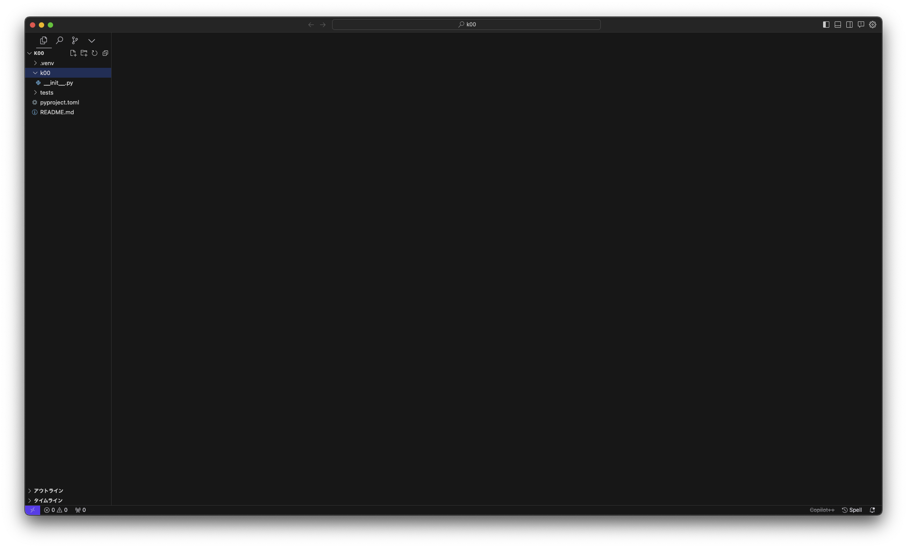
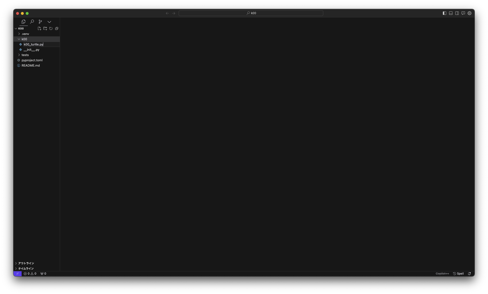
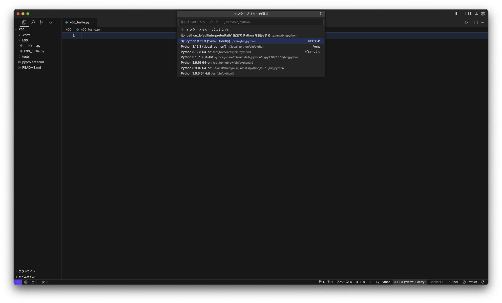
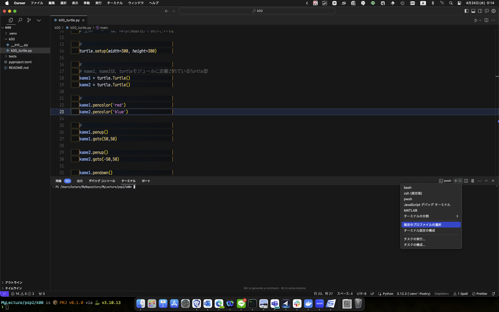
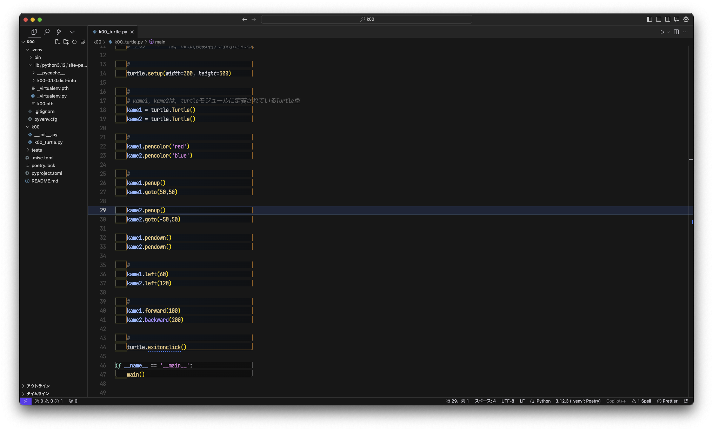

- [day02: vscodeでプログラミング](#day02-vscodeでプログラミング)
  - [1. 課題用のディレクトリを作る](#1-課題用のディレクトリを作る)
    - [1.1. `poetry new k00`](#11-poetry-new-k00)
    - [1.2. `k00/.venv/`](#12-k00venv)
  - [2. それでは今日の課題をやっていきましょう．](#2-それでは今日の課題をやっていきましょう)
    - [2.1. `k00/k00/k00_turtle.py`](#21-k00k00k00_turtlepy)
    - [2.2. `k00/test_k00_turtle.py`:インタフェースからのパッケージ読み込み](#22-k00test_k00_turtlepyインタフェースからのパッケージ読み込み)
    - [2.3. `k00/dists/k00-[...].whl`:提出](#23-k00distsk00-whl提出)
      - [2.3.1. `poetry version`,`poetry build`: wheelに圧縮](#231-poetry-versionpoetry-build-wheelに圧縮)
      - [2.3.2. 提出物のcheck](#232-提出物のcheck)
    - [@. jupyter で実行する場合](#-jupyter-で実行する場合)
  - [3. 今日の課題](#3-今日の課題)
  - [@1. 便利なvscode用コメントアウト　「`# %%`」](#1-便利なvscode用コメントアウト-)
  - [@2. 繰り返し処理](#2-繰り返し処理)
  - [@3. モジュールおよび関数](#3-モジュールおよび関数)
    - [**混乱を生むが許されている他の`import`方法**](#混乱を生むが許されている他のimport方法)

# day02: vscodeでプログラミング

## 1. 課題用のディレクトリを作る

### 1.1. `poetry new k00`

今日の課題は `k00` です．

```{.sh}
> poetry new k00
```

いろいろ聞かれます．よく読んで答えましょう．基本的にはすべて提示されたままでいいですが，`Author`については，`Kotaro Sonoda <aa83988848@ms.nagasaki-u.ac.jp>`などと，「`自分の名前 スペース 三角カッコ
 メールアドレス 三角カッコ閉じ`」にしましょう．

ディレクトリができたら，そのディレクトリの下に移動します．

```{.sh}
> cd k00
```

仮想環境（システムの`site-packages`を用いない，独自の`site-packages`）をpoetry で作成します．独自の`site-packages`を使うことで，システムの`site-packages`に依存させないようにできます．

```{.sh}
> poetry env use py # `py`は仮想環境で`python`として利用するコマンドパス
```

これにより，`.venv/`というディレクトリが新たに作られます．

```{.sh}
> poetry env info

Virtualenv
Python:         3.12.3
Implementation: CPython
Path:           /Users/kotaro/MyRepository/MyLecture/psp2/k00/.venv
Executable:     /Users/kotaro/MyRepository/MyLecture/psp2/k00/.venv/bin/python
Valid:          True

Base
Platform:   darwin
OS:         posix
Python:     3.12.3
Path:       /opt/homebrew/opt/python@3.12/Frameworks/Python.framework/Versions/3.12
Executable: /opt/homebrew/opt/python@3.12/Frameworks/Python.framework/Versions/3.12/bin/python3.12
```

皆さんのところでは，どうなるでしょう．


### 1.2. `k00/.venv/`

仮想環境に入るときには，macやlinuxなら

```{.sh}
> source .venv/bin/activate
```

windows の command promptなら

```{.sh}
> .\.venv\Scripts\Activate.bat
```

windows の PowerShellの場合は，

```{.sh}
PS1 > .\.venv\Scripts\Activate.ps1
```

で入ることができます．この場合プロンプトが`(k00-py3.12)`となります．

仮想環境に入ると，インタプリタの場所，および外部パッケージ置き場が変わります．

仮想環境から出るときには，いずれのOSでも

```{.sh}
> deactivate
```

です．

## 2. それでは今日の課題をやっていきましょう．

### 2.1. `k00/k00/k00_turtle.py`

vscodeを起動します．


左端にあるアイコンは，メニューです．一番下にある帯には，現在開いているファイルに関する「状態」が表示されています．

ウィンドウのほとんどの部分は，エディタです．「ファイル名　x」という感じで，最近のウェブブラウザのように「タブ」が並びます．

初期起動時には，「`Get Started`」というタブが立ち上がっています．使わないので「x」を押して消してください．

一番上にあるアイコンを押してください．これは「エクスプローラ」と呼ばれています．


`OPEN EDITORS`には，現在開いているエディタで編集しているファイル名が並びます．先ほどタブを閉じたので何もありません．

その下には`NO FOLDER OPENED`と表示され，何やら青いボタンが並んでいます．

説明したように，「ファイルを開く」のではなく，「フォルダを開く」というボタンです．ちなみに下のボタン「`Clone Repository`」は「レポジトリ」と呼ばれる特殊なフォルダを開くボタンです．

さきほど作った`k00`フォルダを開きます．

「`NO FOLDER OPENED`」の表示が「`k00`」に変わり，



のように表示されていると思います．

「`K00`」のあたりにマウスを移動させると，その帯の右側に4つのアイコンが並びます．それぞれのアイコンにマウスを移動させると説明が表示されますが，左から，「ファイルを追加」「フォルダを追加」「更新」「表示を縮める」です．



なにかプログラミングしてみましょう．`K00`の下の`k00`というディレクトリが提出するパッケージです．まずは`k00/k00`の下にファイルを追加します．

`v K00`の下の`> k00`をクリックすると，`k00`フォルダが選択され，中身がリストアップされます．



このフォルダで「ファイル追加」アイコンを押して，「`k00_turtle.py`」という名前のファイルを新しく作ってみます．



「`OPENED EDITORS`」に`k00_turtle.py`が列挙され，`k00_turtle.py`というタブが開きます．

もしかしたら，インタープリタを聞かれるかもしれません．そのときは，`./.venv/bin/python`を選びましょう．



`k00_turtle.py` に以下のようなコードを書きましょう．

```{k00_turtle.py}
# coding:utf-8

# 使うモジュールの指定
# turtleというモジュールを使う
import turtle

def main()-> None:
    """
    (このmain関数が何をするのかを書く．)
    """
    # 上の"""〜"""は，help(関数名)で表示される．

    #
    turtle.setup(width=300, height=300)

    #
    # kame1, kame2は，turtleモジュールに定義されているTurtle型
    kame1 = turtle.Turtle()
    kame2 = turtle.Turtle()

    #
    kame1.pencolor('red')
    kame2.pencolor('blue')

    #
    kame1.penup()
    kame1.goto(50,50)

    kame2.penup()
    kame2.goto(-50,50)

    kame1.pendown()
    kame2.pendown()

    #
    kame1.left(60)
    kame2.left(120)

    #
    kame1.forward(100)
    kame2.backward(200)

    #
    turtle.exitonclick()

if __name__ == '__main__':
    main()
```

- 「`"""`」で囲まれた部分は，一般に複数行のコメントアウトで，pythonの実行コードから無視されます．
  - 特に`def`文直後の`"""`ブロックは「**docString**」と呼ばれ，`help()`関数で表示されます．
- 「`#`」記号のある行はいわゆるコメントアウトで，pythonの実行コードから無視されます．
- コメントアウト，文字列，など色分けされていますね．
- 最初の行のコメントアウト「`# coding:utf-8`」は，このソースコードの日本語が文字コード「`utf-8`」で書かれていることをIDEに教えています．Windowsの場合は文字コードが「`shift-jis`」かもしれません．


では，この`k00_turtle.py`を実行しましょう．

vscodeとは別に，コマンドプロンプトを立ち上げて，

```{.sh}
> cd c:\Users\kotaro\Documents\psp2\k00\k00
```

で`k00`フォルダに移動し，

```{.sh}
> poetry run python k00/k00_turtle.py
```

とすればプログラムが動きます．

これでもいいのですが，vscodeはウィンドウの中でコマンドプロンプトを起動できます．上部メニューに「ターミナル」があり，そこに「新しいターミナルを開く」というのがあります．


「`(k00-py3.12)`」というプロンプトのコマンドプロンプトがエディタの下の領域に立ち上がります．フォルダも現在作業中の場所に移動しています．つまり，vscodeでは直下に`.venv`というフォルダがあると，自動的に仮想環境に入るのです．

PowerShellの場合は，プロンプトが変わらないので，仮想環境が適用されているのか否かが不明なので，「規定のプロファイルを選択」からCommand Promptを選んでおきましょう．



実行は，ここで

```{.sh}
(k00-py3.12) > python k00/k00_turtle.py
```

でよいでしょう．

### 2.2. `k00/test_k00_turtle.py`:インタフェースからのパッケージ読み込み

モジュール`k00_turtle.py`は，パッケージ`k00`（ディレクトリ）に含まれています．

このモジュールをインタフェースプログラムの中で呼び出して実行してみましょう．

モジュール関数の呼び出し方は，以下のようになります．

```{.py}
from k00 import k00_turtle as my

my.main()
```

- `from (パッケージディレクトリパス) import （モジュールの拡張子省略名） as （別名）`
- `（別名）.（関数オブジェクト）`で呼び出します．

パスについては，[importについて](https://github.com/helmenov/psp2/blob/e603e02f4d2704fcc895a2654e4c32f8cad4a5cf/reference_import.md#import%E3%81%AB%E3%81%A4%E3%81%84%E3%81%A6)を参照．

パッケージのパス（PATH,場所）は，実行するpython環境の`sys.path`に列挙されているPATHの直下に無ければいけません．

```{.sh}
(k00-py3.12) > python
>>>> import sys
>>>> print(sys.path)
['', '/opt/homebrew/Cellar/python@3.12/3.12.3/Frameworks/Python.framework/Versions/3.12/lib/python312.zip', '/opt/homebrew/Cellar/python@3.12/3.12.3/Frameworks/Python.framework/Versions/3.12/lib/python3.12', '/opt/homebrew/Cellar/python@3.12/3.12.3/Frameworks/Python.framework/Versions/3.12/lib/python3.12/lib-dynload', '/Users/kotaro/MyRepository/MyLecture/psp2/k00/.venv/lib/python3.12/site-packages']
>>>>
```

あなたの`k00`開発環境（仮想環境`.venv`,`(k00-py3.12)`）の`sys.path`の`site-packages`は上記のようになると思います．

唯一の`site-packages`である，`psp2/k00/.venv/lib/python3.12/site-packages`を実際に見てみると


の左側のエクスプローラでわかるように，今のところ`k00`はありません．

```{.sh}
> poetry install --sync
```

をすると，現在作成中のパッケージ`k00/k00`を呼び出せるようになります．

```
(k00-py3.12) > python
>>> import sys
>>> print(sys.path)
['', '/opt/homebrew/Cellar/python@3.12/3.12.3/Frameworks/Python.framework/Versions/3.12/lib/python312.zip', '/opt/homebrew/Cellar/python@3.12/3.12.3/Frameworks/Python.framework/Versions/3.12/lib/python3.12', '/opt/homebrew/Cellar/python@3.12/3.12.3/Frameworks/Python.framework/Versions/3.12/lib/python3.12/lib-dynload', '/Users/kotaro/MyRepository/MyLecture/psp2/k00/.venv/lib/python3.12/site-packages', '/Users/kotaro/MyRepository/MyLecture/psp2/k00']
>>>
```

`sys.path`の中に，`psp2/k00`が加わりました．

また，`site-packages`を見ると



のように，若干ファイルが増えています（だけど，k00フォルダは無い）

`sys.path`に`psp2/k00`フォルダが列挙されているので，`(k00-py3.12)`の仮想環境であれば，
`psp2/k00/k00`というフォルダをパッケージとして読み込むことができます．

たとえば，`psp2/k00/tests/`に`test_k00_turtle.py`という名前で上のインタフェースプログラムを書いておき，

```{.sh}
> poetry run python tests/test_k00_turtle.py
```
でテストできます．

また，

```{.sh}
> poetry run python
>>> from k00 import k00_turtle as my
>>> help(my.main)
Help on function main in module k00.k00_turtle:

main() -> None
    (このmain関数が何をするのかを書く．)
```

で `k00_turtle.py`の`main`関数のdocStringが表示されます．

### 2.3. `k00/dists/k00-[...].whl`:提出

#### 2.3.1. `poetry version`,`poetry build`: wheelに圧縮

```{.sh}
> poetry build
```

で，`k00/dists/k00-0.1.0-py3-none-any.whl`が作られます．

これを提出してください．`0.1.0`はversionです．

再提出の際，`build`の前に以下の操作を行ってください．

- 前に提出したものとモジュール名や関数名を変えない修正なら（例：関数の中の処理を変更．間違いを修正）
   ```{.sh}
   poetry version patch
   ```
- モジュールや関数を増やす修正なら（例：最初の提出は(1)だけだったが，次の提出は(2)のモジュールも増やした）
   ```{.sh}
   poetry version minor
   ```
- モジュールや関数を減らす修正なら（例：関数名を変更した．）
   ```{.sh}
   poetry version major
   ```

`patch`は`a.b.c`の`c`が増え，`minor`は`b`, `major`は`a`が増えます．

#### 2.3.2. 提出物のcheck

TAは，適当な環境で，
```{.sh}
pip install k00-0.1.0-py3-none-any.whl
```
して，`site-packages`に`k00`をインストールします．

そこで上の`test_k00_turtle.py`を実行します．再現されるかな．

チェックが終わったら，忘れずにアンインストールして環境美化に努めます．

```{.sh}
pip uninstall k00
```

### @. jupyter で実行する場合

vscodeやコマンドプロンプト，terminalから実行する場合はよいのですが，jupyterやGoogleColabなどweb上では表示できずエラーになります．

そこで，jupyter用のturtle [ColabTurtlePlus][ColabTurtlePlus] をインストールします．

```{.sh}
> poetry add ColabTurtlePlus
```

さきほどの`k00_turtle.py`で

```{k00_turtle.py}
import turtle
```

のところを

```{k00_turtle.py}
from ColabTurtlePlus import Turtle as turtle
```

としてください．

## 3. 今日の課題

**で，このソースコードは，どんなプログラムでしょうか？**

ざっくり言うと，新しくウインドウが立ち上がって，矢印とカメがそれぞれ線を描きながら動いて停止します．ちなみに，ウインドウが立ち上がったままですが，ウインドウ内のどこかでクリックすると，ウインドウが閉じます．

というわけで，今日の課題

> (1)`k00_turtle.py`のそれぞれの行で行われていることを調べて，ソースコードにそれぞれの行で行われていることをコメントアウトに追記せよ．

> (2)正六角形を描画するモジュール`k00_hexagon.py`を作成せよ．ただし，左半分は矢印で赤，右半分はカメで青で描くこと．`for`文もしくは`while`文などの繰り返し処理を用いること．自分で編集したソースコードのそれぞれの行で行われていることをコメントアウトに追加せよ．

> (3)`k00_pentagon.py`に正N角形を描画する関数`NsidePolygon(n)`を作成し，`NsidePolygon`関数を利用して正五角形を描け．ただし，関数`NsidePolygon(n)`は`n`匹のカメを発生させ，それぞれのカメがそれぞれ各頂点に移動して一つの辺のみを描画することとする．繰り返し処理を利用してできるだけ行数を短くせよ．

> (4)`k00_pentagon.py`を`k00_invalid.py`にコピーし，`NsidePolygon`関数に描く線の色名を引数`color`として指定してできるようにせよ．その上で正五角形を描け．`pencolor('yellow')`で黄色に，`pencolor('blue')`で青色の線を指定できる．ただし，適当な文字列を色名とするとエラーが出てプログラムが止まるであろう．適当な色名が指定されたときには`pencolor('black')`で線を黒色に指定しなおすように，例外処理を加えよ．

> (5) パッケージ`k00`の下にさらにディレクトリ`k00funcs`を作り，その下に`k00_func.py`を作成せよ．(4)の関数`NsidePolygon`関数を`k00_func.py`に書き，`k00_octagon.py`で`from k00funcs import k00_func`として読み込んだ上で，`NsidePolygon`関数を利用して，正八角形を描け．

課題は，

- LACSの課題から，パッケージ`k00`を`wheel`にしたもの，と，描画されたウィンドウのスクリーンショットを提出してください．
- 初めての提出作業は**5月8日正午まで**に必ず行ってください． 課題提出があると，TAや私がそれを採点し，改善点があればコメントを残します．
- コメントを踏まえて再度提出し，10点満点を目指し何度でも提出を受付ます．課題k00の最終期限は**5月22日正午まで**を目安とします．
- 今後の課題も，基本的には，初めての提出の期限を２週間後，最終期限を４週間後とします．

## @1. 便利なvscode用コメントアウト　「`# %%`」

ソースコードは基本的には，`python **.py`だと最初の行から最後の行まですべての工程を行います．

コードのそれぞれの行で何を行っているか調べるなら，もしくは新しく文を書いて，その動きを確かめたいのなら，pythonだとIPythonが有名です．IPythonは，JupyterやGoogle Colabを動かしているプログラムです．

ターミナルやコマンドプロンプトで，`ipython`と打つと，

```{.sh}
(.venv) kotaro@calvados psp2 % ARM❯ ipython                                [04/12 21:31]
Python 3.10.0 (default, Jan 13 2022, 14:22:16) [Clang 13.0.0 (clang-1300.0.29.30)]
Type 'copyright', 'credits' or 'license' for more information
IPython 8.2.0 -- An enhanced Interactive Python. Type '?' for help.
Unable to automatically import mitosheet

In [1]:
```

のように，インタラクティブモードが立ち上がります．

```{.sh}
In [1]: x = 10

In [2]: print(x)
10
```

のように，JupyterやGoogle Colabと何ら変わりません．

ただ，問題なのは，このインタラクティブモードで書いたソースコードは保存されないということ．JupyterやGoogle Colabで書いたものも，基本的には「jupyter notebook」（拡張子は `.ipynb`）であり，pythonのソースコード(`.py`)ではないということです．

JupyterやGoogle Colabではメニューから，JupyterNotebook(`.ipynb`)からpythonソースコード(`.py`)に変換することは可能ですが，

僕らが今欲しいのは，書いているpythonソースコードをブロック毎に動きを確かめたい．そこで，vscodeの「`# %%`」です．

実は，

```{.sh}
「Run Cell | Run Below | Debug Cell」
------------------------------------------
# %%
```

は，vscode上で，pythonソースコードを簡単にインタラクティブモードで動かすコメントアウトになっているのです．凄い便利！！

「`# %%`」から次の「`# %%`」までが，IPythonの「セル」です．

- 「Run Cell」は，セルを実行する
- 「Run Below」は，以下のすべてのセルを実行する
- 「Debug Cell」は，セルをデバグする．（デバグについては後日）

また，このように書かれたpythonソースコード`.py`は，`Run Cell`や`Run Below`で隣に立ち上がったJupyterみたいなタブで`save`をすることでJupyter Notebook `.ipynb`に保存できます．ターミナルで`jupyter notebook`と打つとウェブブラウザが立ち上がり，


ここで，`.ipynb`を選択すると，jupyter Notebookを実行できます．


ちなみに，Jupyter notebookでの編集は，`.ipynb`には反映されますが，元の`.py`には反映されないので注意．

## @2. 繰り返し処理

python言語の繰り返し処理は，

```{.py}
処理文A
for 仮変数X in コンテナP:
    仮変数Xを利用できる処理文B
    仮変数Xを利用できる処理文C
処理文D
```

の形で処理文Bと処理文Cの繰り返しを実現します．

仮変数Xは繰り返しのたびに，コンテナPの先頭から1つだけ要素が代入されます．コンテナPの最後の要素が代入されたら最後の繰り返しとなり，繰り返しブロックを抜けます．

コンテナPがリストの場合，

```{.py}
L = [1, 10, 'blue', 3.14]
for i in L:
    print(i)
for j in L:
    print('i')
```

は，どのように出力されるでしょうか？やってみましょう．

コンテナPが文字列の場合は，どうなるでしょう？

```{.py}
S = 'Programing'
for i in S:
    print(i)
```

コンテナPが辞書の場合は，どうなるでしょう？

```{.py}
D = {'a':1, 'b':10, 'c':'blue', 'd':3.14}
for i in D:
    print(i)
for j in D:
    print(D[j])
```

コンテナPは，スライスでも構いません．

```{.py}
S = 'Programing'
for i in S[1:]:
    print(i)
```

コンテナPは，その場で`range`を利用することもできます．

```{.py}
for i in range(5):
    print(i)
```

`enumerate`も覚えておくとよいでしょう．何が行われるか試してみてください．

```{.py}
S = 'Programing'
for i,j in enumerate(S):
    print(f'{i}:{j}')
```

## @3. モジュールおよび関数

関数は，次のような書き方で宣言でき，同一のファイル内であれば，宣言したあとに呼び出せます．

```{.py}
def 関数名(仮引数...):
    仮引数を利用できる処理文
    return 出力変数

y = 関数名(x)
```

別のファイルに関数が書かれている場合，呼び出し側のファイルでimportします．関数が書かれた`.py`ファイル，またはそのファイル名の`.py`を除いた文字列をモジュールと呼びます．

importについては，[こちら](https://github.com/helmenov/2023psp2/blob/main/reference_import.md)を参考にしてください．

呼び出し側で，関数を呼び出すときは，以下のようにします．

```{.py}
from forder1.forder2 import module
y = module.func(x)
```

のように呼び出し側のファイルでは，単に`関数名`ではなく，`モジュール.関数名`で呼び出します．

`import module as mod`のように別名を指定すれば，

```
y = mod.func(x)
```

のように別名を使うこともできます．

また，モジュールがソースコードと同じフォルダにある場合は，
`from `を省略できます．

また，ソースコードと同じフォルダの下でなくとも，`pip`や`poetry`や`conda`で入れたパッケージやモジュールは`import`できます．


### **混乱を生むが許されている他の`import`方法**

実は他の`import`方法があります．

1. モジュールを`from`にして，関数を`import`

    呼び出し側のソースコードでも，単に関数名になります．
    関数名が他でも使われている場合に混乱します．

    ```{.py}
    from フォルダ.モジュール import func

    y = func(x)
    ```

2. 1でさらにワイルドカード`*`で関数を`import`

    `import`は，「`,`」で区切って複数のものを`import`できますが，
    あるモジュール内に存在するすべての関数を`import`する場合，
    以下のように書くことができます．
    ```{.py}
    from モジュールA import *
    from モジュールB import *

    y = func(x)
    ```

    しかし，この場合，`func`という関数が，どちらのモジュールに書かれているものなのか，ソースコードから読み取れません．どちらのモジュールにも`func`が存在する場合，後ろにあるモジュールBの`func`が利用され，混乱の元になります．


[ColabTurtlePlus]:https://pypi.org/project/ColabTurtlePlus/
