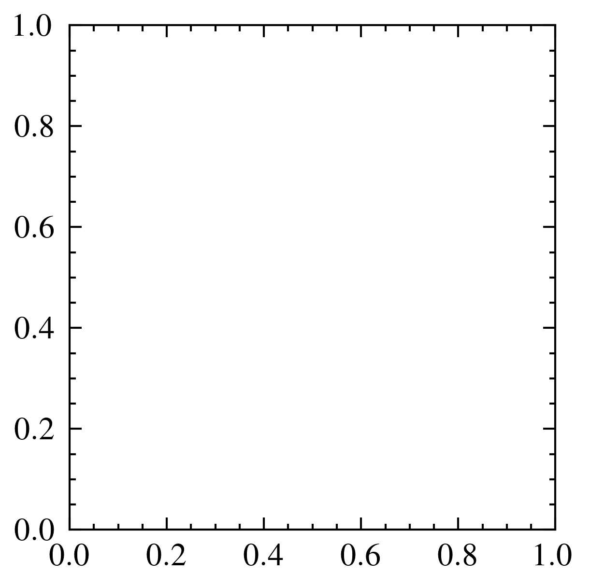
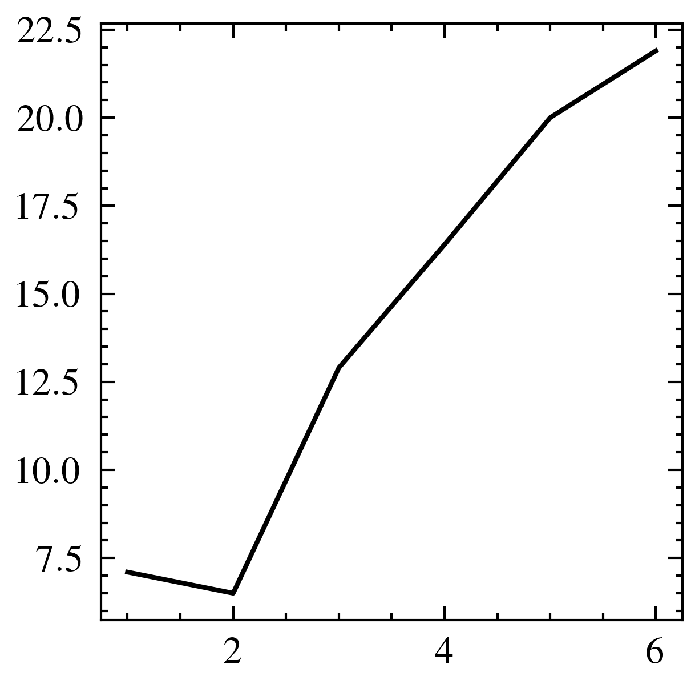
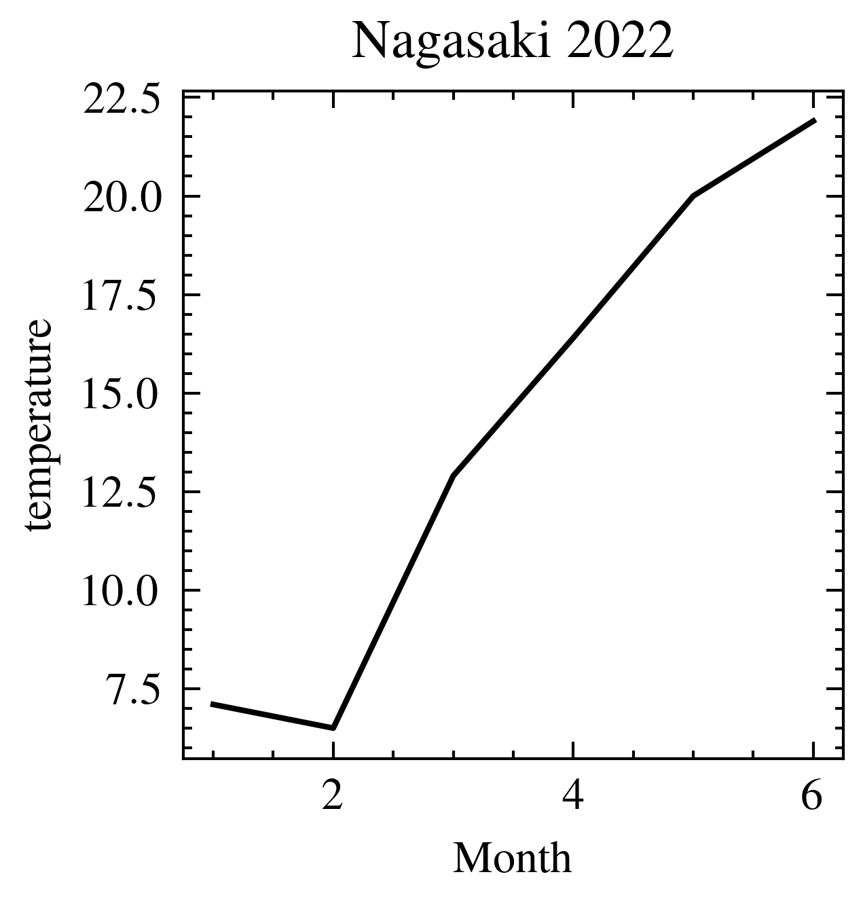
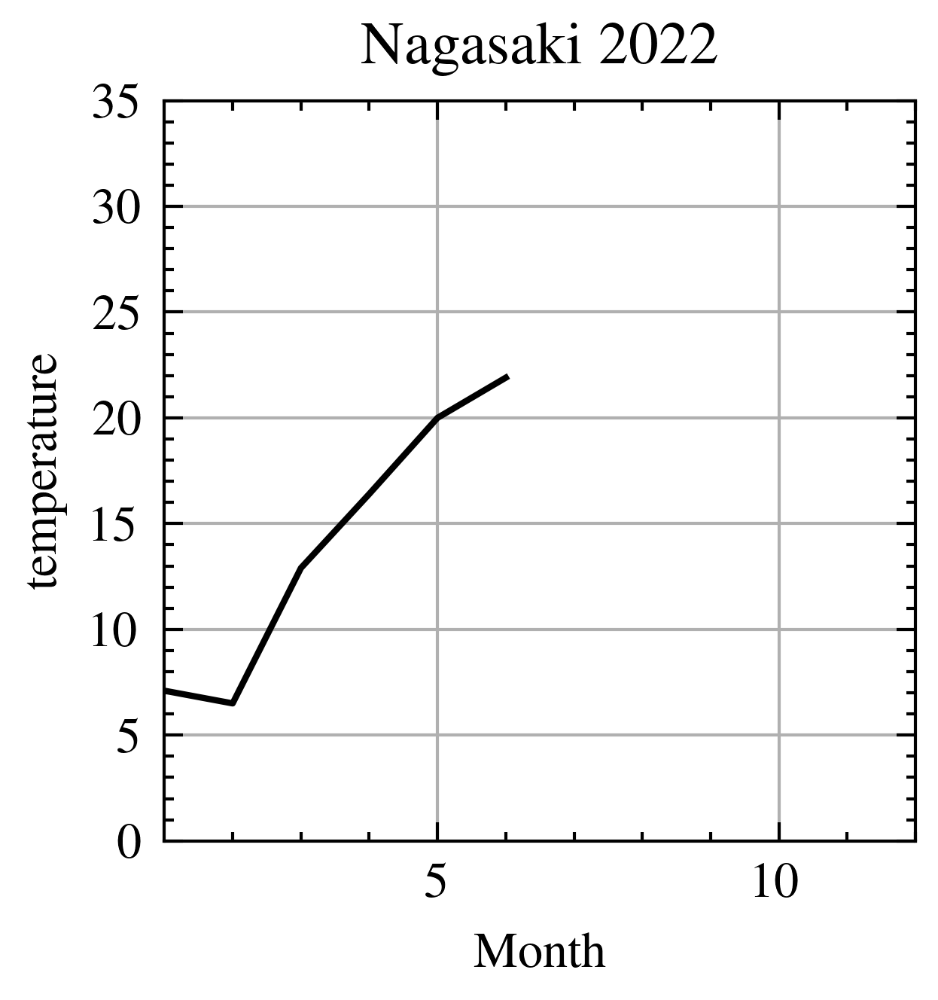
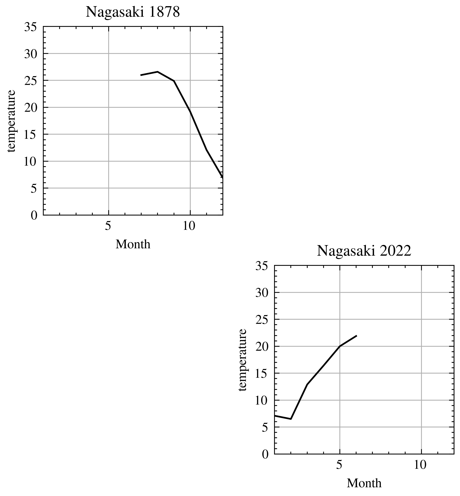
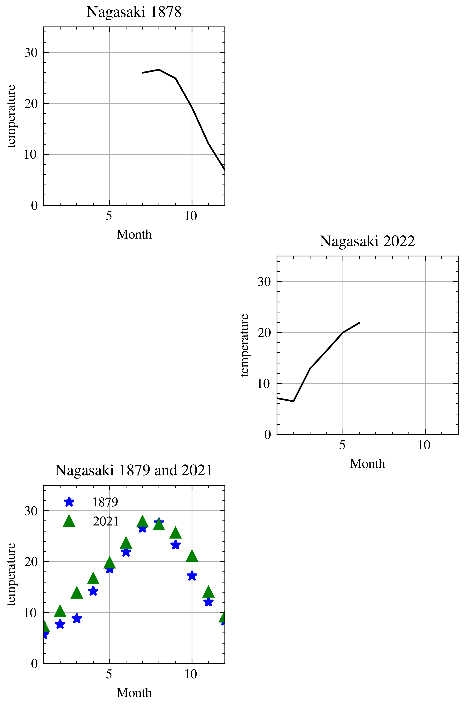
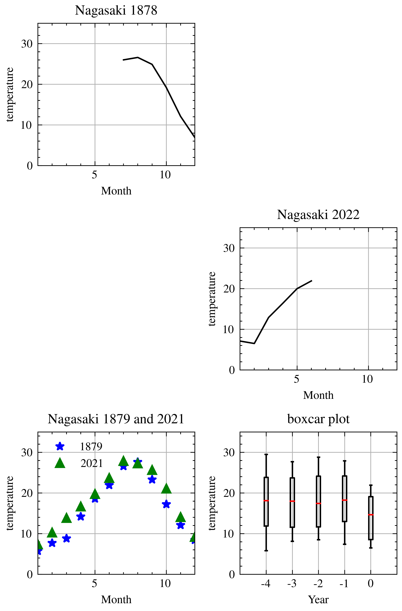

# Numpy 

Pythonでは，値の集合を「コンテナ」と呼び，代表的なものとして

- リスト(List): [1, 'two', [3], 3.14]
    - タプル(Tuple): (1, 'two', [3], 3.14)
    - 文字列(Str): 'aa83988848'
- 集合(Set): {1, 'two', [3], 3.14}
    - 辞書(Dict): {'v1':1, 'v2':'two', 'v3':[3], 'v4':3.14}

があります．コンテナは，基本的に各要素が異なる型(クラス)でも構いません．要素がさらにコンテナであっても構いません．


```python
MyList = [1, 'two', [3], 3.14]
MyTuple = (1, 'two', [3], 3.14)
MyStr = 'aa83988848'
MySet = {1, 'two', 3.14} # setはコンテナを要素に持てない
MyDict = {'v1':1, 'v2':'two', 'v3':[3], 'v4':3.14}

print('==MyList==')
print(f'{MyList}')

print('==MyTuple==')
print(f'{MyTuple}')

print('==MyStr==')
print(f'{MyStr}')

print('==MySet==')
print(f'{MySet}')

print('==MyDict==')
print(f'{MyDict}')

```

    ==MyList==
    [1, 'two', [3], 3.14]
    ==MyTuple==
    (1, 'two', [3], 3.14)
    ==MyStr==
    aa83988848
    ==MySet==
    {1, 'two', 3.14}
    ==MyDict==
    {'v1': 1, 'v2': 'two', 'v3': [3], 'v4': 3.14}


これらのコンテナに対して演算をすると


```python
print('==MyList * 3==')
print(f'{MyList * 3}')

print('==MyTuple * 3==')
print(f'{MyTuple * 3}')

print('==MyStr * 3==')
print(f'{MyStr * 3}')

#print('==MySet * 3==')
#print(f'{MySet * 3}') # Setは演算できない

#print('==MyDict * 3==')
#print(f'{MyDict * 3}') # Dictは演算できない

MyList2 = [1, 2, 3]
print('==MyList + MyList2==')
print(f'{MyList + MyList2}')
```

    ==MyList * 3==
    [1, 'two', [3], 3.14, 1, 'two', [3], 3.14, 1, 'two', [3], 3.14]
    ==MyTuple * 3==
    (1, 'two', [3], 3.14, 1, 'two', [3], 3.14, 1, 'two', [3], 3.14)
    ==MyStr * 3==
    aa83988848aa83988848aa83988848
    ==MyList + MyList2==
    [1, 'two', [3], 3.14, 1, 2, 3]


というように，後ろに繰り返し要素を付け加えることになります．

それぞれの要素に対し演算するには，どうしたらいいでしょうか．そのような演算をベクトル演算といいます．

ベクトル演算をするためのコンテナをNumpy Arrayといいます．

NumPyというパッケージにNumPy Arrayクラスが定義されています．

## Numpy Array


```python
import numpy as np

MyArray = np.array(MyList)
print('==MyArray==')
print(f'{MyArray}')

print('==MyArray * 3==')
print(f'{MyArray * 3}')
```

    ==MyArray==
    [1 'two' list([3]) 3.14]
    ==MyArray * 3==
    [3 'twotwotwo' list([3, 3, 3]) 9.42]


    /var/folders/qq/y0p5l6xd5qb7l_6_x0nmwhv40000gn/T/ipykernel_49141/3223551522.py:3: VisibleDeprecationWarning: Creating an ndarray from ragged nested sequences (which is a list-or-tuple of lists-or-tuples-or ndarrays with different lengths or shapes) is deprecated. If you meant to do this, you must specify 'dtype=object' when creating the ndarray.
      MyArray = np.array(MyList)


- 0番目の要素と3番目の要素は数値なので，3倍されています．
- 1番目の要素は文字列なので，文字列*3，つまりコンテナを後ろに3回繰り返したものになります．
- 2番目の要素もリストなので，リスト*3，つまりコンテナを後ろに3回繰り返したものになります．


要素数の異なるNumpyArrayとの加算はできません．


```python
MyArray2 = np.array(MyList2)
print('==MyArray + MyArray2==')
#print(f'{MyArray + MyArray2}')
```

    ==MyArray + MyArray2==


NumpyArrayは，線形代数における行列やベクトルなので，行列やベクトルに対する演算しか許されないというわけです．

## テンソル

「NumpyArrayは，行列やベクトル」と言いましたが，行列やベクトルには形があります．

$$
M = \begin{bmatrix}
1 & 2 & 3 \\
4 & 5 & 6
\end{bmatrix}
$$    

のとき，Mの形は「2行3列」です．

$$
v = \begin{bmatrix}
7 \\
8 \\
9
\end{bmatrix}
$$

のとき，vの形は「3行1列」ですね．

$$
u = \begin{bmatrix}
10 & 11 
\end{bmatrix}
$$

のとき，uの形は「1行2列」ですね．

NumpyArrayで 2行3列の行列を作ってみましょう．
すべての要素がゼロな2行3列の行列は，Numpyのzeros関数で作ることができます．


```python
M = np.zeros((2,3))
print(M)

```

    [[0. 0. 0.]
     [0. 0. 0.]]


行列の形は 属性`.shape`に保存されています．


```python
print(M.shape)
```

    (2, 3)


形(2,3)のMを`print`したときの表示を見てみると，「行ごとの3つの要素がリストになっており，2行のリストをさらにリストに」しています．

実は，このようなリストからNumpyArrayを作ることもできます．


```python
u1 = [1,2,3]
u2 = [4,5,6]
L = [u1, u2]
M = np.array(L)
print(M)
print(M.shape)

```

    [[1 2 3]
     [4 5 6]]
    (2, 3)


では，7と8と9を要素にもつ1行3列のNumpyArrayを作ってみましょう．行ごとにリストに，全体をさらにリストにします．つまり2重リストになります．


```python
Lx = [[7,8,9]]
x = np.array(Lx)
print(x)
print(x.shape)
```

    [[7 8 9]]
    (1, 3)


このxを転置すれば，Mxが計算できます．転置はNumpyの`transpose`関数を使います．また，行列積はNumpyの`matmul`関数です．(ちなみに`*`は要素積（要素同士の積）です．)


```python
R = np.matmul(M, np.transpose(x))
print(R)
print(R.shape)
```

    [[ 50]
     [122]]
    (2, 1)


皆が知っているように，行列積は，「左の行列の列数」と「右の行列の行数」が同じでなければいけません．上の例の場合，(2,3)と(3,1)なので行列積は(2,1)となるわけですね．

ところで，xは行列でしょうか？ベクトルでしょうか？

行ベクトルとか列ベクトルと言われているものですが，Numpyでは
「行数」とか「列数」とか言っているので，これは「行列」なのです．では，ベクトルは？

ベクトルとは，1重のリストから作ったものをいいます．「行」や「列」という概念がありません．


```python
Ly = [7,8,9]
y = np.array(Ly)
print(y)
print(y.shape)
```

    [7 8 9]
    (3,)


さきほどの x は形が(1,3)で，転置した`np.transpose(x)`は(3,1)でした．今度の y は(3,)です．さきほどの行列積ができます．


```python
R2 = np.matmul(M, y)
print(R2)
print(R2.shape)
```

    [ 50 122]
    (2,)


R2はさきほどのRと要素は同じ数値ですが，(2,1)ではなく(2,)となります．（行列積の作られ方どおりです．）

まとめると
- 行列: 2重のリストから作られる．形は (S1, S2)，行数S1, 列数S2
- ベクトル: 1重のリストから作られる．形は (S1,), 要素数S1

行列積は，np.matmul関数で，
- 左のArrayの形が(S1,S2)で，右のArrayの形が(S3,S4)のとき，S2==S3なら演算できて，答えのArrayの形は(S1,S4)

転置は np.transpose関数で，
- 形が(S1,S2)の行列の転置は，形が(S2,S1)となる
- 形が(S1,)のベクトルの転置は，形が変わらず(S1,)となる


```python
print(y.shape)
yt = np.transpose(y)
print(yt.shape)
```

    (3,)
    (3,)


行列やベクトルをまとめて，一般的に「テンソル」と言います．さきほどの「n重のリスト」の`n`を階数といいます．

- 行列: 2階テンソル
- ベクトル: 1階テンソル

ここで，1重リストを並べたものをさらにリストにすれば，2重リストになるので，すなわち(S1,)ベクトル（1階テンソル）をS2個並べると(S2,S1)行列（2階テンソル）になるということです．
要素が(S1,)ベクトルである(S2,)ベクトルは，(S2,S1)という行列になります．

属性`.ndim`に保存されています．属性`.shape`に保存されている「形」を表すタプルの要素数でもあります．


```python
A1 = np.array([1,2,3,4])
print(A1)
print(f'shape(形):{A1.shape}')
print(f'ndim(階数):{A1.ndim}')
print(f'size(要素数):{A1.size}')
print('\n')

A2 = np.array([[1,2,3,4]])
print(A2)
print(f'shape(形):{A2.shape}')
print(f'ndim(階数):{A2.ndim}')
print(f'size(要素数):{A2.size}')
print('\n')

A3 = np.array([[[1,2,3,4]]])
print(A2)
print(f'shape(形):{A3.shape}')
print(f'ndim(階数):{A3.ndim}')
print(f'size(要素数):{A3.size}')
print('\n')


```

    [1 2 3 4]
    shape(形):(4,)
    ndim(階数):1
    size(要素数):4
    
    
    [[1 2 3 4]]
    shape(形):(1, 4)
    ndim(階数):2
    size(要素数):4
    
    
    [[1 2 3 4]]
    shape(形):(1, 1, 4)
    ndim(階数):3
    size(要素数):4
    
    


3階以上になっても行列積(テンソル積)は同じです．


```python
T3 = np.array([[[1,2,3,4]]])
T1 = np.array([5,6,7,8])
Result = np.matmul(T3,T1)
print(f'{T3.ndim}階テンソル（形{T3.shape})と{T1.ndim}階テンソル(形{T1.shape})の行列積は{Result.ndim}階テンソル（形{Result.shape})')
print(Result)
```

    3階テンソル（形(1, 1, 4))と1階テンソル(形(4,))の行列積は2階テンソル（形(1, 1))
    [[70]]


## 抽出


```python
M = np.array([[1,2,3,4],[5,6,7,8],[9,10,11,12]])
print(M,type(M),M.shape,M.ndim,M.size,'\n')

M_row = M[1] # 行
print(M_row,type(M_row),M_row.shape,M_row.ndim,M_row.size,'\n')

M_item = M[1][2] # (1,2)要素 M[1,2]とは書けない
print(M_item,type(M_item),M_item.shape,M_item.ndim,M_item.size,'\n')

M_slice = M[1:3,0:2] #スライス
print(M_slice,type(M_slice),M_slice.shape,M_slice.ndim,M_slice.size,'\n')

M_column = M[:,1] # 列抽出はスライスで
print(M_column,type(M_column),M_column.shape,M_column.ndim,M_column.size,'\n')

M_sub = M[[0,2],[1,3]] # (0,1)要素と(2,3)要素　（スライス）
print(M_sub,type(M_sub),M_sub.shape,M_sub.ndim,M_sub.size)
```

    [[ 1  2  3  4]
     [ 5  6  7  8]
     [ 9 10 11 12]] <class 'numpy.ndarray'> (3, 4) 2 12 
    
    [5 6 7 8] <class 'numpy.ndarray'> (4,) 1 4 
    
    7 <class 'numpy.int64'> () 0 1 
    
    [[ 5  6]
     [ 9 10]] <class 'numpy.ndarray'> (2, 2) 2 4 
    
    [ 2  6 10] <class 'numpy.ndarray'> (3,) 1 3 
    
    [ 2 12] <class 'numpy.ndarray'> (2,) 1 2


## 追加


```python
u1 = np.array([[1,2],[3,4]])
u2 = np.array([[11,12],[13,14]])

print('==np.concat: 階数を変えずに，連結する．==')
M1 = np.concatenate([u1,u2])
print(M1)
print(f'形:{M1.shape},階:{M1.ndim},要素数:{M1.size}\n')
M2 = np.concatenate([u1,u2],axis=1)
print(M2)
print(f'形:{M2.shape},階:{M2.ndim},要素数:{M2.size}\n')

print('==np.stack: 指定した階に，積む==')
M3 = np.stack([u1,u2],axis=0)
print(M3)
print(f'形:{M3.shape},階:{M3.ndim},要素数:{M3.size}\n')

M4 = np.stack([u1,u2],axis=1)
print(M4)
print(f'形:{M4.shape},階:{M4.ndim},要素数:{M4.size}\n')

M5 = np.stack([u1,u2],axis=2)
print(M5)
print(f'形:{M5.shape},階:{M5.ndim},要素数:{M5.size}\n')

```

    ==np.concat: 階数を変えずに，連結する．==
    [[ 1  2]
     [ 3  4]
     [11 12]
     [13 14]]
    形:(4, 2),階:2,要素数:8
    
    [[ 1  2 11 12]
     [ 3  4 13 14]]
    形:(2, 4),階:2,要素数:8
    
    ==np.stack: 指定した階に，積む==
    [[[ 1  2]
      [ 3  4]]
    
     [[11 12]
      [13 14]]]
    形:(2, 2, 2),階:3,要素数:8
    
    [[[ 1  2]
      [11 12]]
    
     [[ 3  4]
      [13 14]]]
    形:(2, 2, 2),階:3,要素数:8
    
    [[[ 1 11]
      [ 2 12]]
    
     [[ 3 13]
      [ 4 14]]]
    形:(2, 2, 2),階:3,要素数:8
    


# 形を変形


```python
T = np.array([[1,2,3,4],[5,6,7,8]])
print(T)
print(f'形:{T.shape}, 階:{T.ndim}, 要素数:{T.size}\n')

T2 = np.reshape(T,(1,8))
print(T2)
print('前から順に8要素のリストを1個')
print(f'形:{T2.shape}, 階:{T2.ndim}, 要素数:{T2.size}\n')

T3 = np.reshape(T,(8,1))
print(T3)
print('前から順に1要素のリストを8個')
print(f'形:{T3.shape}, 階:{T3.ndim}, 要素数:{T3.size}\n')


T4 = np.reshape(T,(4,2))
print(T4)
print('前から順に2要素のリストを4個')
print(f'形:{T4.shape}, 階:{T4.ndim}, 要素数:{T4.size}\n')

T5 = np.reshape(T,(8,))
print(T5)
print('前から順に8要素')
print(f'形:{T5.shape}, 階:{T5.ndim}, 要素数:{T5.size}\n')

T6 = np.reshape(T,(1,2,4))
print(T6)
print('前から順に4要素2個の要素を1個')
print(f'形:{T6.shape}, 階:{T6.ndim}, 要素数:{T6.size}\n')

```

    [[1 2 3 4]
     [5 6 7 8]]
    形:(2, 4), 階:2, 要素数:8
    
    [[1 2 3 4 5 6 7 8]]
    前から順に8要素のリストを1個
    形:(1, 8), 階:2, 要素数:8
    
    [[1]
     [2]
     [3]
     [4]
     [5]
     [6]
     [7]
     [8]]
    前から順に1要素のリストを8個
    形:(8, 1), 階:2, 要素数:8
    
    [[1 2]
     [3 4]
     [5 6]
     [7 8]]
    前から順に2要素のリストを4個
    形:(4, 2), 階:2, 要素数:8
    
    [1 2 3 4 5 6 7 8]
    前から順に8要素
    形:(8,), 階:1, 要素数:8
    
    [[[1 2 3 4]
      [5 6 7 8]]]
    前から順に4要素2個の要素を1個
    形:(1, 2, 4), 階:3, 要素数:8
    


## pandasのデータフレーム

行列といえば，データフレームと見た目が似ています．
- どちらも，行の要素数が各列で同じ，列の要素数が各行で同じでなければならない．（普通のList,Tuple,Set,Dictでは違う）

ということで，

- 2階テンソル（行列）のNumpyArrayはpandasデータフレームに変換できます．: pandasの`DataFrame`関数
- pandasデータフレームは，2階のNumpyArray（行列）に変換できます．: pandasのDataFrameクラスの`to_numpy`メソッド

NumpyArrayの行が，pandasの1行のサンプルに対応しています．


```python
import pandas as pd

M = np.array([[1,2,3,4],[5,6,7,8],[9,10,11,12]])
print(M)
print('\n')

columnsM = ['v0','v1','v2','v3']
indexM = ['#1','#2','#3']
df = pd.DataFrame(M,columns=columnsM,index=indexM)
print(df)
print('\n')

M2 = df.to_numpy()
print(M2)

```

    [[ 1  2  3  4]
     [ 5  6  7  8]
     [ 9 10 11 12]]
    
    
        v0  v1  v2  v3
    #1   1   2   3   4
    #2   5   6   7   8
    #3   9  10  11  12
    
    
    [[ 1  2  3  4]
     [ 5  6  7  8]
     [ 9 10 11 12]]


## pandas.read_htmlによるスクレイピング

ホームページや画像などからデータフレームを読み込む操作を「スクレイピング」と呼びます．

例えば，長崎の気温変化をデータフレームに読み込んでみましょう．

長崎の気温変化は，[Link](https://www.data.jma.go.jp/obd/stats/etrn/view/monthly_s3.php?prec_no=84&block_no=47817&year=&month=&day=&view=a1)にあります．

このページには，文章の中に，表がありますね．

pandasの`read_html`関数はURLを指定すると，そのURLのページに含まれる表の数だけデータフレームを作って，そのリストを返します．


```python
import lxml
from datetime import datetime

URL = 'https://www.data.jma.go.jp/obd/stats/etrn/view/monthly_s3.php?prec_no=84&block_no=47817&year=&month=&day=&view=a1'
df_List = pd.read_html(URL,header=0)
df_List[0]
```


<div>
<style scoped>
    .dataframe tbody tr th:only-of-type {
        vertical-align: middle;
    }

    .dataframe tbody tr th {
        vertical-align: top;
    }

    .dataframe thead th {
        text-align: right;
    }
</style>
<table border="1" class="dataframe">
  <thead>
    <tr style="text-align: right;">
      <th></th>
      <th>年</th>
      <th>1月</th>
      <th>2月</th>
      <th>3月</th>
      <th>4月</th>
      <th>5月</th>
      <th>6月</th>
      <th>7月</th>
      <th>8月</th>
      <th>9月</th>
      <th>10月</th>
      <th>11月</th>
      <th>12月</th>
      <th>年の値</th>
    </tr>
  </thead>
  <tbody>
    <tr>
      <th>0</th>
      <td>1878</td>
      <td>NaN</td>
      <td>NaN</td>
      <td>NaN</td>
      <td>NaN</td>
      <td>NaN</td>
      <td>NaN</td>
      <td>26.0</td>
      <td>26.6</td>
      <td>24.9</td>
      <td>19.2</td>
      <td>12.1</td>
      <td>6.9</td>
      <td>19.3 ]</td>
    </tr>
    <tr>
      <th>1</th>
      <td>1879</td>
      <td>5.7</td>
      <td>7.7</td>
      <td>8.8</td>
      <td>14.2</td>
      <td>18.6</td>
      <td>21.9</td>
      <td>26.6</td>
      <td>27.6</td>
      <td>23.3</td>
      <td>17.2</td>
      <td>12.1</td>
      <td>8.4</td>
      <td>16.0</td>
    </tr>
    <tr>
      <th>2</th>
      <td>1880</td>
      <td>4.8</td>
      <td>8.3</td>
      <td>9.9</td>
      <td>14.1</td>
      <td>19.4</td>
      <td>21.2</td>
      <td>25.4</td>
      <td>25.8</td>
      <td>23.7</td>
      <td>18.8</td>
      <td>11.7</td>
      <td>5.3</td>
      <td>15.7</td>
    </tr>
    <tr>
      <th>3</th>
      <td>1881</td>
      <td>4.0</td>
      <td>5.9</td>
      <td>7.5</td>
      <td>14.1</td>
      <td>18.8</td>
      <td>22.3</td>
      <td>26.3</td>
      <td>27.8</td>
      <td>24.6</td>
      <td>18.2</td>
      <td>13.6</td>
      <td>7.9</td>
      <td>15.9</td>
    </tr>
    <tr>
      <th>4</th>
      <td>1882</td>
      <td>7.3</td>
      <td>6.7</td>
      <td>8.8</td>
      <td>14.7</td>
      <td>17.9</td>
      <td>20.6</td>
      <td>25.0</td>
      <td>26.4</td>
      <td>23.0</td>
      <td>19.4</td>
      <td>12.3</td>
      <td>6.8</td>
      <td>15.7</td>
    </tr>
    <tr>
      <th>...</th>
      <td>...</td>
      <td>...</td>
      <td>...</td>
      <td>...</td>
      <td>...</td>
      <td>...</td>
      <td>...</td>
      <td>...</td>
      <td>...</td>
      <td>...</td>
      <td>...</td>
      <td>...</td>
      <td>...</td>
      <td>...</td>
    </tr>
    <tr>
      <th>140</th>
      <td>2018</td>
      <td>5.8</td>
      <td>6.3</td>
      <td>12.4</td>
      <td>17.1</td>
      <td>20.4</td>
      <td>23.5</td>
      <td>28.2</td>
      <td>29.5</td>
      <td>24.9</td>
      <td>19.1</td>
      <td>14.5</td>
      <td>10.3</td>
      <td>17.7</td>
    </tr>
    <tr>
      <th>141</th>
      <td>2019</td>
      <td>8.1</td>
      <td>9.4</td>
      <td>11.9</td>
      <td>15.8</td>
      <td>20.2</td>
      <td>23.0</td>
      <td>25.8</td>
      <td>27.7</td>
      <td>26.0</td>
      <td>20.9</td>
      <td>15.1</td>
      <td>10.6</td>
      <td>17.9</td>
    </tr>
    <tr>
      <th>142</th>
      <td>2020</td>
      <td>9.7</td>
      <td>9.8</td>
      <td>12.3</td>
      <td>14.0</td>
      <td>20.2</td>
      <td>24.1</td>
      <td>25.5</td>
      <td>28.8</td>
      <td>24.3</td>
      <td>19.6</td>
      <td>15.3</td>
      <td>8.5</td>
      <td>17.7</td>
    </tr>
    <tr>
      <th>143</th>
      <td>2021</td>
      <td>7.4</td>
      <td>10.3</td>
      <td>13.9</td>
      <td>16.7</td>
      <td>19.8</td>
      <td>23.7</td>
      <td>27.9</td>
      <td>27.3</td>
      <td>25.7</td>
      <td>21.1</td>
      <td>14.1</td>
      <td>9.2</td>
      <td>18.1</td>
    </tr>
    <tr>
      <th>144</th>
      <td>2022</td>
      <td>7.1</td>
      <td>6.5</td>
      <td>12.9</td>
      <td>16.4</td>
      <td>20.0</td>
      <td>21.9 ]</td>
      <td>NaN</td>
      <td>NaN</td>
      <td>NaN</td>
      <td>NaN</td>
      <td>NaN</td>
      <td>NaN</td>
      <td>12.6 ]</td>
    </tr>
  </tbody>
</table>
<p>145 rows × 14 columns</p>
</div>


まず，月ごとに列を成していますが，この列名は「年」と合わせて，1列にすべきです．


```python
df = df_List[0].drop(columns=['年の値'])
df

```


<div>
<style scoped>
    .dataframe tbody tr th:only-of-type {
        vertical-align: middle;
    }

    .dataframe tbody tr th {
        vertical-align: top;
    }

    .dataframe thead th {
        text-align: right;
    }
</style>
<table border="1" class="dataframe">
  <thead>
    <tr style="text-align: right;">
      <th></th>
      <th>年</th>
      <th>1月</th>
      <th>2月</th>
      <th>3月</th>
      <th>4月</th>
      <th>5月</th>
      <th>6月</th>
      <th>7月</th>
      <th>8月</th>
      <th>9月</th>
      <th>10月</th>
      <th>11月</th>
      <th>12月</th>
    </tr>
  </thead>
  <tbody>
    <tr>
      <th>0</th>
      <td>1878</td>
      <td>NaN</td>
      <td>NaN</td>
      <td>NaN</td>
      <td>NaN</td>
      <td>NaN</td>
      <td>NaN</td>
      <td>26.0</td>
      <td>26.6</td>
      <td>24.9</td>
      <td>19.2</td>
      <td>12.1</td>
      <td>6.9</td>
    </tr>
    <tr>
      <th>1</th>
      <td>1879</td>
      <td>5.7</td>
      <td>7.7</td>
      <td>8.8</td>
      <td>14.2</td>
      <td>18.6</td>
      <td>21.9</td>
      <td>26.6</td>
      <td>27.6</td>
      <td>23.3</td>
      <td>17.2</td>
      <td>12.1</td>
      <td>8.4</td>
    </tr>
    <tr>
      <th>2</th>
      <td>1880</td>
      <td>4.8</td>
      <td>8.3</td>
      <td>9.9</td>
      <td>14.1</td>
      <td>19.4</td>
      <td>21.2</td>
      <td>25.4</td>
      <td>25.8</td>
      <td>23.7</td>
      <td>18.8</td>
      <td>11.7</td>
      <td>5.3</td>
    </tr>
    <tr>
      <th>3</th>
      <td>1881</td>
      <td>4.0</td>
      <td>5.9</td>
      <td>7.5</td>
      <td>14.1</td>
      <td>18.8</td>
      <td>22.3</td>
      <td>26.3</td>
      <td>27.8</td>
      <td>24.6</td>
      <td>18.2</td>
      <td>13.6</td>
      <td>7.9</td>
    </tr>
    <tr>
      <th>4</th>
      <td>1882</td>
      <td>7.3</td>
      <td>6.7</td>
      <td>8.8</td>
      <td>14.7</td>
      <td>17.9</td>
      <td>20.6</td>
      <td>25.0</td>
      <td>26.4</td>
      <td>23.0</td>
      <td>19.4</td>
      <td>12.3</td>
      <td>6.8</td>
    </tr>
    <tr>
      <th>...</th>
      <td>...</td>
      <td>...</td>
      <td>...</td>
      <td>...</td>
      <td>...</td>
      <td>...</td>
      <td>...</td>
      <td>...</td>
      <td>...</td>
      <td>...</td>
      <td>...</td>
      <td>...</td>
      <td>...</td>
    </tr>
    <tr>
      <th>140</th>
      <td>2018</td>
      <td>5.8</td>
      <td>6.3</td>
      <td>12.4</td>
      <td>17.1</td>
      <td>20.4</td>
      <td>23.5</td>
      <td>28.2</td>
      <td>29.5</td>
      <td>24.9</td>
      <td>19.1</td>
      <td>14.5</td>
      <td>10.3</td>
    </tr>
    <tr>
      <th>141</th>
      <td>2019</td>
      <td>8.1</td>
      <td>9.4</td>
      <td>11.9</td>
      <td>15.8</td>
      <td>20.2</td>
      <td>23.0</td>
      <td>25.8</td>
      <td>27.7</td>
      <td>26.0</td>
      <td>20.9</td>
      <td>15.1</td>
      <td>10.6</td>
    </tr>
    <tr>
      <th>142</th>
      <td>2020</td>
      <td>9.7</td>
      <td>9.8</td>
      <td>12.3</td>
      <td>14.0</td>
      <td>20.2</td>
      <td>24.1</td>
      <td>25.5</td>
      <td>28.8</td>
      <td>24.3</td>
      <td>19.6</td>
      <td>15.3</td>
      <td>8.5</td>
    </tr>
    <tr>
      <th>143</th>
      <td>2021</td>
      <td>7.4</td>
      <td>10.3</td>
      <td>13.9</td>
      <td>16.7</td>
      <td>19.8</td>
      <td>23.7</td>
      <td>27.9</td>
      <td>27.3</td>
      <td>25.7</td>
      <td>21.1</td>
      <td>14.1</td>
      <td>9.2</td>
    </tr>
    <tr>
      <th>144</th>
      <td>2022</td>
      <td>7.1</td>
      <td>6.5</td>
      <td>12.9</td>
      <td>16.4</td>
      <td>20.0</td>
      <td>21.9 ]</td>
      <td>NaN</td>
      <td>NaN</td>
      <td>NaN</td>
      <td>NaN</td>
      <td>NaN</td>
      <td>NaN</td>
    </tr>
  </tbody>
</table>
<p>145 rows × 13 columns</p>
</div>


```python
df2 = pd.melt(df,id_vars=['年'],value_vars=df.columns[1:])
df2
```


<div>
<style scoped>
    .dataframe tbody tr th:only-of-type {
        vertical-align: middle;
    }

    .dataframe tbody tr th {
        vertical-align: top;
    }

    .dataframe thead th {
        text-align: right;
    }
</style>
<table border="1" class="dataframe">
  <thead>
    <tr style="text-align: right;">
      <th></th>
      <th>年</th>
      <th>variable</th>
      <th>value</th>
    </tr>
  </thead>
  <tbody>
    <tr>
      <th>0</th>
      <td>1878</td>
      <td>1月</td>
      <td>NaN</td>
    </tr>
    <tr>
      <th>1</th>
      <td>1879</td>
      <td>1月</td>
      <td>5.7</td>
    </tr>
    <tr>
      <th>2</th>
      <td>1880</td>
      <td>1月</td>
      <td>4.8</td>
    </tr>
    <tr>
      <th>3</th>
      <td>1881</td>
      <td>1月</td>
      <td>4.0</td>
    </tr>
    <tr>
      <th>4</th>
      <td>1882</td>
      <td>1月</td>
      <td>7.3</td>
    </tr>
    <tr>
      <th>...</th>
      <td>...</td>
      <td>...</td>
      <td>...</td>
    </tr>
    <tr>
      <th>1735</th>
      <td>2018</td>
      <td>12月</td>
      <td>10.3</td>
    </tr>
    <tr>
      <th>1736</th>
      <td>2019</td>
      <td>12月</td>
      <td>10.6</td>
    </tr>
    <tr>
      <th>1737</th>
      <td>2020</td>
      <td>12月</td>
      <td>8.5</td>
    </tr>
    <tr>
      <th>1738</th>
      <td>2021</td>
      <td>12月</td>
      <td>9.2</td>
    </tr>
    <tr>
      <th>1739</th>
      <td>2022</td>
      <td>12月</td>
      <td>NaN</td>
    </tr>
  </tbody>
</table>
<p>1740 rows × 3 columns</p>
</div>


```python
df2['date'] = df2['年'].astype(str)+'年'+df2['variable']
df2['date']
```


    0        1878年1月
    1        1879年1月
    2        1880年1月
    3        1881年1月
    4        1882年1月
              ...   
    1735    2018年12月
    1736    2019年12月
    1737    2020年12月
    1738    2021年12月
    1739    2022年12月
    Name: date, Length: 1740, dtype: object


```python
df2['date2'] = [datetime.strptime(s,'%Y年%m月') for s in df2['date']]
df2['date2']
```


    0      1878-01-01
    1      1879-01-01
    2      1880-01-01
    3      1881-01-01
    4      1882-01-01
              ...    
    1735   2018-12-01
    1736   2019-12-01
    1737   2020-12-01
    1738   2021-12-01
    1739   2022-12-01
    Name: date2, Length: 1740, dtype: datetime64[ns]


```python
df3 = df2.drop(columns=['年','variable','date'])
df3.head()
```


<div>
<style scoped>
    .dataframe tbody tr th:only-of-type {
        vertical-align: middle;
    }

    .dataframe tbody tr th {
        vertical-align: top;
    }

    .dataframe thead th {
        text-align: right;
    }
</style>
<table border="1" class="dataframe">
  <thead>
    <tr style="text-align: right;">
      <th></th>
      <th>value</th>
      <th>date2</th>
    </tr>
  </thead>
  <tbody>
    <tr>
      <th>0</th>
      <td>NaN</td>
      <td>1878-01-01</td>
    </tr>
    <tr>
      <th>1</th>
      <td>5.7</td>
      <td>1879-01-01</td>
    </tr>
    <tr>
      <th>2</th>
      <td>4.8</td>
      <td>1880-01-01</td>
    </tr>
    <tr>
      <th>3</th>
      <td>4.0</td>
      <td>1881-01-01</td>
    </tr>
    <tr>
      <th>4</th>
      <td>7.3</td>
      <td>1882-01-01</td>
    </tr>
  </tbody>
</table>
</div>


```python
df3.columns=['temperature','Date']
df4 = df3.set_index('Date')
df5 = df4.sort_index()
df5
```


<div>
<style scoped>
    .dataframe tbody tr th:only-of-type {
        vertical-align: middle;
    }

    .dataframe tbody tr th {
        vertical-align: top;
    }

    .dataframe thead th {
        text-align: right;
    }
</style>
<table border="1" class="dataframe">
  <thead>
    <tr style="text-align: right;">
      <th></th>
      <th>temperature</th>
    </tr>
    <tr>
      <th>Date</th>
      <th></th>
    </tr>
  </thead>
  <tbody>
    <tr>
      <th>1878-01-01</th>
      <td>NaN</td>
    </tr>
    <tr>
      <th>1878-02-01</th>
      <td>NaN</td>
    </tr>
    <tr>
      <th>1878-03-01</th>
      <td>NaN</td>
    </tr>
    <tr>
      <th>1878-04-01</th>
      <td>NaN</td>
    </tr>
    <tr>
      <th>1878-05-01</th>
      <td>NaN</td>
    </tr>
    <tr>
      <th>...</th>
      <td>...</td>
    </tr>
    <tr>
      <th>2022-08-01</th>
      <td>NaN</td>
    </tr>
    <tr>
      <th>2022-09-01</th>
      <td>NaN</td>
    </tr>
    <tr>
      <th>2022-10-01</th>
      <td>NaN</td>
    </tr>
    <tr>
      <th>2022-11-01</th>
      <td>NaN</td>
    </tr>
    <tr>
      <th>2022-12-01</th>
      <td>NaN</td>
    </tr>
  </tbody>
</table>
<p>1740 rows × 1 columns</p>
</div>


```python
df5['temperature'] = df5['temperature'].astype(str)
```


```python
df6 = df5['temperature'].str.extract('([ 0-9.]+)')
df6.columns=['temperature']
df6['temperature'] = df6['temperature'].astype(float)
df6.sort_index(inplace=True)
df6.dropna(inplace=True)
df6.tail(12)
```


<div>
<style scoped>
    .dataframe tbody tr th:only-of-type {
        vertical-align: middle;
    }

    .dataframe tbody tr th {
        vertical-align: top;
    }

    .dataframe thead th {
        text-align: right;
    }
</style>
<table border="1" class="dataframe">
  <thead>
    <tr style="text-align: right;">
      <th></th>
      <th>temperature</th>
    </tr>
    <tr>
      <th>Date</th>
      <th></th>
    </tr>
  </thead>
  <tbody>
    <tr>
      <th>2021-07-01</th>
      <td>27.9</td>
    </tr>
    <tr>
      <th>2021-08-01</th>
      <td>27.3</td>
    </tr>
    <tr>
      <th>2021-09-01</th>
      <td>25.7</td>
    </tr>
    <tr>
      <th>2021-10-01</th>
      <td>21.1</td>
    </tr>
    <tr>
      <th>2021-11-01</th>
      <td>14.1</td>
    </tr>
    <tr>
      <th>2021-12-01</th>
      <td>9.2</td>
    </tr>
    <tr>
      <th>2022-01-01</th>
      <td>7.1</td>
    </tr>
    <tr>
      <th>2022-02-01</th>
      <td>6.5</td>
    </tr>
    <tr>
      <th>2022-03-01</th>
      <td>12.9</td>
    </tr>
    <tr>
      <th>2022-04-01</th>
      <td>16.4</td>
    </tr>
    <tr>
      <th>2022-05-01</th>
      <td>20.0</td>
    </tr>
    <tr>
      <th>2022-06-01</th>
      <td>21.9</td>
    </tr>
  </tbody>
</table>
</div>


## matplotlib

Matplotlibは，入力した系列に対応してグラフを描くライブラリです．

下のようなグラフを描きます．このグラフに書いてある用語（英単語）をそのまま覚えてください．


- Figure：フィギュア：所謂，キャンバスのことです．Figureに描かれるのは，
    - 複数のグラフ(Axes)
    - キャンバスのタイトル，凡例

- Axes：アクセス：所謂，グラフのことです．Axesに描かれるのは，
    - 軸線(Axis)
    - 軸ラベル(xlabel, ylabel)
    - プロット（Plot, データを使って書かれた線や点）

- Axis：アクシス：所謂，軸線のことです．Axis上に描かれるのは，
    - 目盛印(Tick，ティック)：目盛として軸に刻みで描かれる細い線
    - 目盛文字列(Tick Label)：目盛の刻みに振られる文字列（数直線ならば数字．数字でなくてもいい）


グラフを描くには，

1. まず，キャンバスを用意する


```python
from matplotlib import pyplot as plt
plt.style.use(['science','ieee'])

fig = plt.figure(tight_layout=True,figsize=(4,6),facecolor='white')
fig
```


    <Figure size 2400x3600 with 0 Axes>


    <Figure size 2400x3600 with 0 Axes>


2. グラフ領域を用意する: `fig.add_subplot(3,2,4)`
    
    例) キャンバスを3行2列の行列状に領域を分けたときの左上から4番目の領域


```python
ax1 = fig.add_subplot(3,2,4)
fig
```





2. グラフを描く
    
    2.1. プロットを描く  

        ```
        ax1.plot(x座標の系列, y座標の系列)
        ```


```python
ax1.plot([1,2,3,4,5,6], df6['temperature'][-6:])
fig
```





    2.2. 軸ラベル，タイトル，凡例を補正する
    
        ```
        ax1.set_xlabel('横軸ラベル')
        ```
    


```python
ax1.set_xlabel('Month')
ax1.set_ylabel('temperature')
ax1.set_title('Nagasaki 2022')
fig
```





    2.3. グリッド線をつけたり，表示領域を決めたり
        ```
        ax1.set_xlim()
        ax1.grid()
        ```


```python

ax1.set_ylim([0,35])
ax1.set_xlim([1,12])
ax1.grid()
fig
```





キャンバスの別の領域に別のグラフを書く


```python
ax2 = fig.add_subplot(3,2,1)
print(df6.index[:6])
ax2.plot([7,8,9,10,11,12],df6['temperature'][:6])
ax2.set_xlabel('Month')
ax2.set_ylabel('temperature')
ax2.set_title('Nagasaki 1878')
ax2.set_ylim([0,35])
ax2.set_xlim([1,12])
ax2.grid()
fig
```

    DatetimeIndex(['1878-07-01', '1878-08-01', '1878-09-01', '1878-10-01',
                   '1878-11-01', '1878-12-01'],
                  dtype='datetime64[ns]', name='Date', freq=None)





```python
ax3 = fig.add_subplot(3,2,5)
ax3.plot(range(1,13),df6['temperature'][6:18],'b*',label='1879')
ax3.plot(range(1,13),df6['temperature'][-18:-6],'g^',label='2021')
ax3.set_xlabel('Month')
ax3.set_ylabel('temperature')
ax3.set_title('Nagasaki 1879 and 2021')
ax3.set_ylim([0,35])
ax3.set_xlim([1,12])
ax3.legend(loc='best')
ax3.grid()
fig
```





箱ひげ図を書くこともできる．: `boxplot`

- 箱ひげ図を置く横軸目盛を`positions`で指定する


```python
ax4 = fig.add_subplot(3,2,6)
ax4.boxplot(df6['temperature'][-6:],positions=[0])
ax4.boxplot(df6['temperature'][-18:-6],positions=[-1])
ax4.boxplot(df6['temperature'][-30:-18],positions=[-2])
ax4.boxplot(df6['temperature'][-42:-30],positions=[-3])
ax4.boxplot(df6['temperature'][-54:-42],positions=[-4])
ax4.set_xlabel('Year')
ax4.set_ylabel('temperature')
ax4.set_title('boxcar plot')
ax4.set_ylim([0,35])
ax4.set_xlim([-5, 1])
ax4.legend(loc='best')
ax4.grid()
fig


fig
```

    No artists with labels found to put in legend.  Note that artists whose label start with an underscore are ignored when legend() is called with no argument.
    /Users/kotaro/MyRepository/2022psp2/.venv/lib/python3.10/site-packages/matplotlib/ticker.py:2789: RuntimeWarning: invalid value encountered in log10
      majorstep_no_exponent = 10 ** (np.log10(majorstep) % 1)





## 課題 k03


上記で紹介した[リンク](https://www.data.jma.go.jp/obd/stats/etrn/view/monthly_s3.php?prec_no=84&block_no=47817&year=&month=&day=&view=a1) https://www.data.jma.go.jp/obd/stats/etrn/view/monthly_s3.php?prec_no=84&block_no=47817&year=&month=&day=&view=a1 のページには，「日平均気温」の表が見えていますが，
「日平均気温」以外にも同様の形式のデータを選ぶことができます．

適当なデータをスクレイピングして，4種類のグラフを1枚のキャンバスに図示するプログラム`k03.py`を作成せよ．グラフのタイトルや軸ラベルを適切につけること．

提出物
1. `k03.py`
2. 図示したキャンバスを保存した画像


```python
import pandas as pd
import tabula # tabula-py: pdfをDataFrameに読むために必要

url_base = 'https://www.city.nagasaki.lg.jp/fukushi/450000/454000/p034301_d/fil/'
year = '2022'
month = '06'
df = pd.DataFrame()
for date in range(1,28):
    date = f'{date:02d}'
    url = url_base + year + month + date
    try:
        dflist = tabula.read_pdf(url+'.pdf', lattice=True, pandas_options={'header':1}, pages='2')
    except:
        url = url + '-1'
        dflist = tabula.read_pdf(url+'.pdf', lattice=True, pandas_options={'header':1}, pages='2')
    df_row = dflist[1][-1:]
    df_row.loc[1,'date'] = year+month+date
    cols = df_row.columns.tolist()
    unnamed = [x for x in cols if x.startswith('Unnamed:')]
    df_row.drop(columns=unnamed,inplace=True)
    df = pd.concat([df,df_row])
df

#df = dflist[2]
#df.columns = dflist[2].iloc[0].tolist()
#df
```

    Got stderr: 6月 29, 2022 12:45:19 午前 org.apache.fontbox.ttf.CmapSubtable processSubtype14
    警告: Format 14 cmap table is not supported and will be ignored
    
    /var/folders/qq/y0p5l6xd5qb7l_6_x0nmwhv40000gn/T/ipykernel_66416/3951939018.py:17: SettingWithCopyWarning: 
    A value is trying to be set on a copy of a slice from a DataFrame.
    Try using .loc[row_indexer,col_indexer] = value instead
    
    See the caveats in the documentation: https://pandas.pydata.org/pandas-docs/stable/user_guide/indexing.html#returning-a-view-versus-a-copy
      df_row.loc[1,'date'] = year+month+date
    /var/folders/qq/y0p5l6xd5qb7l_6_x0nmwhv40000gn/T/ipykernel_66416/3951939018.py:20: SettingWithCopyWarning: 
    A value is trying to be set on a copy of a slice from a DataFrame
    
    See the caveats in the documentation: https://pandas.pydata.org/pandas-docs/stable/user_guide/indexing.html#returning-a-view-versus-a-copy
      df_row.drop(columns=unnamed,inplace=True)
    Got stderr: 6月 29, 2022 12:45:19 午前 org.apache.fontbox.ttf.CmapSubtable processSubtype14
    警告: Format 14 cmap table is not supported and will be ignored
    
    /var/folders/qq/y0p5l6xd5qb7l_6_x0nmwhv40000gn/T/ipykernel_66416/3951939018.py:17: SettingWithCopyWarning: 
    A value is trying to be set on a copy of a slice from a DataFrame.
    Try using .loc[row_indexer,col_indexer] = value instead
    
    See the caveats in the documentation: https://pandas.pydata.org/pandas-docs/stable/user_guide/indexing.html#returning-a-view-versus-a-copy
      df_row.loc[1,'date'] = year+month+date
    /var/folders/qq/y0p5l6xd5qb7l_6_x0nmwhv40000gn/T/ipykernel_66416/3951939018.py:20: SettingWithCopyWarning: 
    A value is trying to be set on a copy of a slice from a DataFrame
    
    See the caveats in the documentation: https://pandas.pydata.org/pandas-docs/stable/user_guide/indexing.html#returning-a-view-versus-a-copy
      df_row.drop(columns=unnamed,inplace=True)
    Got stderr: 6月 29, 2022 12:45:20 午前 org.apache.fontbox.ttf.CmapSubtable processSubtype14
    警告: Format 14 cmap table is not supported and will be ignored
    
    /var/folders/qq/y0p5l6xd5qb7l_6_x0nmwhv40000gn/T/ipykernel_66416/3951939018.py:17: SettingWithCopyWarning: 
    A value is trying to be set on a copy of a slice from a DataFrame.
    Try using .loc[row_indexer,col_indexer] = value instead
    
    See the caveats in the documentation: https://pandas.pydata.org/pandas-docs/stable/user_guide/indexing.html#returning-a-view-versus-a-copy
      df_row.loc[1,'date'] = year+month+date
    /var/folders/qq/y0p5l6xd5qb7l_6_x0nmwhv40000gn/T/ipykernel_66416/3951939018.py:20: SettingWithCopyWarning: 
    A value is trying to be set on a copy of a slice from a DataFrame
    
    See the caveats in the documentation: https://pandas.pydata.org/pandas-docs/stable/user_guide/indexing.html#returning-a-view-versus-a-copy
      df_row.drop(columns=unnamed,inplace=True)
    Got stderr: 6月 29, 2022 12:45:20 午前 org.apache.fontbox.ttf.CmapSubtable processSubtype14
    警告: Format 14 cmap table is not supported and will be ignored
    
    /var/folders/qq/y0p5l6xd5qb7l_6_x0nmwhv40000gn/T/ipykernel_66416/3951939018.py:17: SettingWithCopyWarning: 
    A value is trying to be set on a copy of a slice from a DataFrame.
    Try using .loc[row_indexer,col_indexer] = value instead
    
    See the caveats in the documentation: https://pandas.pydata.org/pandas-docs/stable/user_guide/indexing.html#returning-a-view-versus-a-copy
      df_row.loc[1,'date'] = year+month+date
    /var/folders/qq/y0p5l6xd5qb7l_6_x0nmwhv40000gn/T/ipykernel_66416/3951939018.py:20: SettingWithCopyWarning: 
    A value is trying to be set on a copy of a slice from a DataFrame
    
    See the caveats in the documentation: https://pandas.pydata.org/pandas-docs/stable/user_guide/indexing.html#returning-a-view-versus-a-copy
      df_row.drop(columns=unnamed,inplace=True)
    /var/folders/qq/y0p5l6xd5qb7l_6_x0nmwhv40000gn/T/ipykernel_66416/3951939018.py:17: SettingWithCopyWarning: 
    A value is trying to be set on a copy of a slice from a DataFrame
    
    See the caveats in the documentation: https://pandas.pydata.org/pandas-docs/stable/user_guide/indexing.html#returning-a-view-versus-a-copy
      df_row.loc[1,'date'] = year+month+date
    Got stderr: 6月 29, 2022 12:45:22 午前 org.apache.fontbox.ttf.CmapSubtable processSubtype14
    警告: Format 14 cmap table is not supported and will be ignored
    
    /var/folders/qq/y0p5l6xd5qb7l_6_x0nmwhv40000gn/T/ipykernel_66416/3951939018.py:17: SettingWithCopyWarning: 
    A value is trying to be set on a copy of a slice from a DataFrame.
    Try using .loc[row_indexer,col_indexer] = value instead
    
    See the caveats in the documentation: https://pandas.pydata.org/pandas-docs/stable/user_guide/indexing.html#returning-a-view-versus-a-copy
      df_row.loc[1,'date'] = year+month+date
    /var/folders/qq/y0p5l6xd5qb7l_6_x0nmwhv40000gn/T/ipykernel_66416/3951939018.py:20: SettingWithCopyWarning: 
    A value is trying to be set on a copy of a slice from a DataFrame
    
    See the caveats in the documentation: https://pandas.pydata.org/pandas-docs/stable/user_guide/indexing.html#returning-a-view-versus-a-copy
      df_row.drop(columns=unnamed,inplace=True)
    Got stderr: 6月 29, 2022 12:45:23 午前 org.apache.fontbox.ttf.CmapSubtable processSubtype14
    警告: Format 14 cmap table is not supported and will be ignored
    
    /var/folders/qq/y0p5l6xd5qb7l_6_x0nmwhv40000gn/T/ipykernel_66416/3951939018.py:17: SettingWithCopyWarning: 
    A value is trying to be set on a copy of a slice from a DataFrame.
    Try using .loc[row_indexer,col_indexer] = value instead
    
    See the caveats in the documentation: https://pandas.pydata.org/pandas-docs/stable/user_guide/indexing.html#returning-a-view-versus-a-copy
      df_row.loc[1,'date'] = year+month+date
    /var/folders/qq/y0p5l6xd5qb7l_6_x0nmwhv40000gn/T/ipykernel_66416/3951939018.py:20: SettingWithCopyWarning: 
    A value is trying to be set on a copy of a slice from a DataFrame
    
    See the caveats in the documentation: https://pandas.pydata.org/pandas-docs/stable/user_guide/indexing.html#returning-a-view-versus-a-copy
      df_row.drop(columns=unnamed,inplace=True)
    Got stderr: 6月 29, 2022 12:45:23 午前 org.apache.fontbox.ttf.CmapSubtable processSubtype14
    警告: Format 14 cmap table is not supported and will be ignored
    
    /var/folders/qq/y0p5l6xd5qb7l_6_x0nmwhv40000gn/T/ipykernel_66416/3951939018.py:17: SettingWithCopyWarning: 
    A value is trying to be set on a copy of a slice from a DataFrame.
    Try using .loc[row_indexer,col_indexer] = value instead
    
    See the caveats in the documentation: https://pandas.pydata.org/pandas-docs/stable/user_guide/indexing.html#returning-a-view-versus-a-copy
      df_row.loc[1,'date'] = year+month+date
    /var/folders/qq/y0p5l6xd5qb7l_6_x0nmwhv40000gn/T/ipykernel_66416/3951939018.py:20: SettingWithCopyWarning: 
    A value is trying to be set on a copy of a slice from a DataFrame
    
    See the caveats in the documentation: https://pandas.pydata.org/pandas-docs/stable/user_guide/indexing.html#returning-a-view-versus-a-copy
      df_row.drop(columns=unnamed,inplace=True)
    Got stderr: 6月 29, 2022 12:45:24 午前 org.apache.fontbox.ttf.CmapSubtable processSubtype14
    警告: Format 14 cmap table is not supported and will be ignored
    
    /var/folders/qq/y0p5l6xd5qb7l_6_x0nmwhv40000gn/T/ipykernel_66416/3951939018.py:17: SettingWithCopyWarning: 
    A value is trying to be set on a copy of a slice from a DataFrame.
    Try using .loc[row_indexer,col_indexer] = value instead
    
    See the caveats in the documentation: https://pandas.pydata.org/pandas-docs/stable/user_guide/indexing.html#returning-a-view-versus-a-copy
      df_row.loc[1,'date'] = year+month+date
    /var/folders/qq/y0p5l6xd5qb7l_6_x0nmwhv40000gn/T/ipykernel_66416/3951939018.py:20: SettingWithCopyWarning: 
    A value is trying to be set on a copy of a slice from a DataFrame
    
    See the caveats in the documentation: https://pandas.pydata.org/pandas-docs/stable/user_guide/indexing.html#returning-a-view-versus-a-copy
      df_row.drop(columns=unnamed,inplace=True)
    Got stderr: 6月 29, 2022 12:45:25 午前 org.apache.fontbox.ttf.CmapSubtable processSubtype14
    警告: Format 14 cmap table is not supported and will be ignored
    
    /var/folders/qq/y0p5l6xd5qb7l_6_x0nmwhv40000gn/T/ipykernel_66416/3951939018.py:17: SettingWithCopyWarning: 
    A value is trying to be set on a copy of a slice from a DataFrame.
    Try using .loc[row_indexer,col_indexer] = value instead
    
    See the caveats in the documentation: https://pandas.pydata.org/pandas-docs/stable/user_guide/indexing.html#returning-a-view-versus-a-copy
      df_row.loc[1,'date'] = year+month+date
    /var/folders/qq/y0p5l6xd5qb7l_6_x0nmwhv40000gn/T/ipykernel_66416/3951939018.py:20: SettingWithCopyWarning: 
    A value is trying to be set on a copy of a slice from a DataFrame
    
    See the caveats in the documentation: https://pandas.pydata.org/pandas-docs/stable/user_guide/indexing.html#returning-a-view-versus-a-copy
      df_row.drop(columns=unnamed,inplace=True)
    Got stderr: 6月 29, 2022 12:45:26 午前 org.apache.fontbox.ttf.CmapSubtable processSubtype14
    警告: Format 14 cmap table is not supported and will be ignored
    
    /var/folders/qq/y0p5l6xd5qb7l_6_x0nmwhv40000gn/T/ipykernel_66416/3951939018.py:17: SettingWithCopyWarning: 
    A value is trying to be set on a copy of a slice from a DataFrame.
    Try using .loc[row_indexer,col_indexer] = value instead
    
    See the caveats in the documentation: https://pandas.pydata.org/pandas-docs/stable/user_guide/indexing.html#returning-a-view-versus-a-copy
      df_row.loc[1,'date'] = year+month+date
    /var/folders/qq/y0p5l6xd5qb7l_6_x0nmwhv40000gn/T/ipykernel_66416/3951939018.py:20: SettingWithCopyWarning: 
    A value is trying to be set on a copy of a slice from a DataFrame
    
    See the caveats in the documentation: https://pandas.pydata.org/pandas-docs/stable/user_guide/indexing.html#returning-a-view-versus-a-copy
      df_row.drop(columns=unnamed,inplace=True)
    /var/folders/qq/y0p5l6xd5qb7l_6_x0nmwhv40000gn/T/ipykernel_66416/3951939018.py:17: SettingWithCopyWarning: 
    A value is trying to be set on a copy of a slice from a DataFrame
    
    See the caveats in the documentation: https://pandas.pydata.org/pandas-docs/stable/user_guide/indexing.html#returning-a-view-versus-a-copy
      df_row.loc[1,'date'] = year+month+date
    Got stderr: 6月 29, 2022 12:45:27 午前 org.apache.fontbox.ttf.CmapSubtable processSubtype14
    警告: Format 14 cmap table is not supported and will be ignored
    
    /var/folders/qq/y0p5l6xd5qb7l_6_x0nmwhv40000gn/T/ipykernel_66416/3951939018.py:17: SettingWithCopyWarning: 
    A value is trying to be set on a copy of a slice from a DataFrame.
    Try using .loc[row_indexer,col_indexer] = value instead
    
    See the caveats in the documentation: https://pandas.pydata.org/pandas-docs/stable/user_guide/indexing.html#returning-a-view-versus-a-copy
      df_row.loc[1,'date'] = year+month+date
    /var/folders/qq/y0p5l6xd5qb7l_6_x0nmwhv40000gn/T/ipykernel_66416/3951939018.py:20: SettingWithCopyWarning: 
    A value is trying to be set on a copy of a slice from a DataFrame
    
    See the caveats in the documentation: https://pandas.pydata.org/pandas-docs/stable/user_guide/indexing.html#returning-a-view-versus-a-copy
      df_row.drop(columns=unnamed,inplace=True)
    Got stderr: 6月 29, 2022 12:45:27 午前 org.apache.fontbox.ttf.CmapSubtable processSubtype14
    警告: Format 14 cmap table is not supported and will be ignored
    
    /var/folders/qq/y0p5l6xd5qb7l_6_x0nmwhv40000gn/T/ipykernel_66416/3951939018.py:17: SettingWithCopyWarning: 
    A value is trying to be set on a copy of a slice from a DataFrame.
    Try using .loc[row_indexer,col_indexer] = value instead
    
    See the caveats in the documentation: https://pandas.pydata.org/pandas-docs/stable/user_guide/indexing.html#returning-a-view-versus-a-copy
      df_row.loc[1,'date'] = year+month+date
    /var/folders/qq/y0p5l6xd5qb7l_6_x0nmwhv40000gn/T/ipykernel_66416/3951939018.py:20: SettingWithCopyWarning: 
    A value is trying to be set on a copy of a slice from a DataFrame
    
    See the caveats in the documentation: https://pandas.pydata.org/pandas-docs/stable/user_guide/indexing.html#returning-a-view-versus-a-copy
      df_row.drop(columns=unnamed,inplace=True)
    Got stderr: 6月 29, 2022 12:45:28 午前 org.apache.fontbox.ttf.CmapSubtable processSubtype14
    警告: Format 14 cmap table is not supported and will be ignored
    
    /var/folders/qq/y0p5l6xd5qb7l_6_x0nmwhv40000gn/T/ipykernel_66416/3951939018.py:17: SettingWithCopyWarning: 
    A value is trying to be set on a copy of a slice from a DataFrame.
    Try using .loc[row_indexer,col_indexer] = value instead
    
    See the caveats in the documentation: https://pandas.pydata.org/pandas-docs/stable/user_guide/indexing.html#returning-a-view-versus-a-copy
      df_row.loc[1,'date'] = year+month+date
    /var/folders/qq/y0p5l6xd5qb7l_6_x0nmwhv40000gn/T/ipykernel_66416/3951939018.py:20: SettingWithCopyWarning: 
    A value is trying to be set on a copy of a slice from a DataFrame
    
    See the caveats in the documentation: https://pandas.pydata.org/pandas-docs/stable/user_guide/indexing.html#returning-a-view-versus-a-copy
      df_row.drop(columns=unnamed,inplace=True)
    Got stderr: 6月 29, 2022 12:45:29 午前 org.apache.fontbox.ttf.CmapSubtable processSubtype14
    警告: Format 14 cmap table is not supported and will be ignored
    
    /var/folders/qq/y0p5l6xd5qb7l_6_x0nmwhv40000gn/T/ipykernel_66416/3951939018.py:17: SettingWithCopyWarning: 
    A value is trying to be set on a copy of a slice from a DataFrame.
    Try using .loc[row_indexer,col_indexer] = value instead
    
    See the caveats in the documentation: https://pandas.pydata.org/pandas-docs/stable/user_guide/indexing.html#returning-a-view-versus-a-copy
      df_row.loc[1,'date'] = year+month+date
    /var/folders/qq/y0p5l6xd5qb7l_6_x0nmwhv40000gn/T/ipykernel_66416/3951939018.py:20: SettingWithCopyWarning: 
    A value is trying to be set on a copy of a slice from a DataFrame
    
    See the caveats in the documentation: https://pandas.pydata.org/pandas-docs/stable/user_guide/indexing.html#returning-a-view-versus-a-copy
      df_row.drop(columns=unnamed,inplace=True)
    Got stderr: 6月 29, 2022 12:45:29 午前 org.apache.fontbox.ttf.CmapSubtable processSubtype14
    警告: Format 14 cmap table is not supported and will be ignored
    
    /var/folders/qq/y0p5l6xd5qb7l_6_x0nmwhv40000gn/T/ipykernel_66416/3951939018.py:17: SettingWithCopyWarning: 
    A value is trying to be set on a copy of a slice from a DataFrame.
    Try using .loc[row_indexer,col_indexer] = value instead
    
    See the caveats in the documentation: https://pandas.pydata.org/pandas-docs/stable/user_guide/indexing.html#returning-a-view-versus-a-copy
      df_row.loc[1,'date'] = year+month+date
    /var/folders/qq/y0p5l6xd5qb7l_6_x0nmwhv40000gn/T/ipykernel_66416/3951939018.py:20: SettingWithCopyWarning: 
    A value is trying to be set on a copy of a slice from a DataFrame
    
    See the caveats in the documentation: https://pandas.pydata.org/pandas-docs/stable/user_guide/indexing.html#returning-a-view-versus-a-copy
      df_row.drop(columns=unnamed,inplace=True)
    /var/folders/qq/y0p5l6xd5qb7l_6_x0nmwhv40000gn/T/ipykernel_66416/3951939018.py:17: SettingWithCopyWarning: 
    A value is trying to be set on a copy of a slice from a DataFrame
    
    See the caveats in the documentation: https://pandas.pydata.org/pandas-docs/stable/user_guide/indexing.html#returning-a-view-versus-a-copy
      df_row.loc[1,'date'] = year+month+date
    Got stderr: 6月 29, 2022 12:45:30 午前 org.apache.fontbox.ttf.CmapSubtable processSubtype14
    警告: Format 14 cmap table is not supported and will be ignored
    
    /var/folders/qq/y0p5l6xd5qb7l_6_x0nmwhv40000gn/T/ipykernel_66416/3951939018.py:17: SettingWithCopyWarning: 
    A value is trying to be set on a copy of a slice from a DataFrame.
    Try using .loc[row_indexer,col_indexer] = value instead
    
    See the caveats in the documentation: https://pandas.pydata.org/pandas-docs/stable/user_guide/indexing.html#returning-a-view-versus-a-copy
      df_row.loc[1,'date'] = year+month+date
    /var/folders/qq/y0p5l6xd5qb7l_6_x0nmwhv40000gn/T/ipykernel_66416/3951939018.py:20: SettingWithCopyWarning: 
    A value is trying to be set on a copy of a slice from a DataFrame
    
    See the caveats in the documentation: https://pandas.pydata.org/pandas-docs/stable/user_guide/indexing.html#returning-a-view-versus-a-copy
      df_row.drop(columns=unnamed,inplace=True)
    Got stderr: 6月 29, 2022 12:45:31 午前 org.apache.fontbox.ttf.CmapSubtable processSubtype14
    警告: Format 14 cmap table is not supported and will be ignored
    
    /var/folders/qq/y0p5l6xd5qb7l_6_x0nmwhv40000gn/T/ipykernel_66416/3951939018.py:17: SettingWithCopyWarning: 
    A value is trying to be set on a copy of a slice from a DataFrame.
    Try using .loc[row_indexer,col_indexer] = value instead
    
    See the caveats in the documentation: https://pandas.pydata.org/pandas-docs/stable/user_guide/indexing.html#returning-a-view-versus-a-copy
      df_row.loc[1,'date'] = year+month+date
    /var/folders/qq/y0p5l6xd5qb7l_6_x0nmwhv40000gn/T/ipykernel_66416/3951939018.py:20: SettingWithCopyWarning: 
    A value is trying to be set on a copy of a slice from a DataFrame
    
    See the caveats in the documentation: https://pandas.pydata.org/pandas-docs/stable/user_guide/indexing.html#returning-a-view-versus-a-copy
      df_row.drop(columns=unnamed,inplace=True)
    Got stderr: 6月 29, 2022 12:45:32 午前 org.apache.fontbox.ttf.CmapSubtable processSubtype14
    警告: Format 14 cmap table is not supported and will be ignored
    
    /var/folders/qq/y0p5l6xd5qb7l_6_x0nmwhv40000gn/T/ipykernel_66416/3951939018.py:17: SettingWithCopyWarning: 
    A value is trying to be set on a copy of a slice from a DataFrame.
    Try using .loc[row_indexer,col_indexer] = value instead
    
    See the caveats in the documentation: https://pandas.pydata.org/pandas-docs/stable/user_guide/indexing.html#returning-a-view-versus-a-copy
      df_row.loc[1,'date'] = year+month+date
    /var/folders/qq/y0p5l6xd5qb7l_6_x0nmwhv40000gn/T/ipykernel_66416/3951939018.py:20: SettingWithCopyWarning: 
    A value is trying to be set on a copy of a slice from a DataFrame
    
    See the caveats in the documentation: https://pandas.pydata.org/pandas-docs/stable/user_guide/indexing.html#returning-a-view-versus-a-copy
      df_row.drop(columns=unnamed,inplace=True)
    Got stderr: 6月 29, 2022 12:45:32 午前 org.apache.fontbox.ttf.CmapSubtable processSubtype14
    警告: Format 14 cmap table is not supported and will be ignored
    
    /var/folders/qq/y0p5l6xd5qb7l_6_x0nmwhv40000gn/T/ipykernel_66416/3951939018.py:17: SettingWithCopyWarning: 
    A value is trying to be set on a copy of a slice from a DataFrame.
    Try using .loc[row_indexer,col_indexer] = value instead
    
    See the caveats in the documentation: https://pandas.pydata.org/pandas-docs/stable/user_guide/indexing.html#returning-a-view-versus-a-copy
      df_row.loc[1,'date'] = year+month+date
    /var/folders/qq/y0p5l6xd5qb7l_6_x0nmwhv40000gn/T/ipykernel_66416/3951939018.py:20: SettingWithCopyWarning: 
    A value is trying to be set on a copy of a slice from a DataFrame
    
    See the caveats in the documentation: https://pandas.pydata.org/pandas-docs/stable/user_guide/indexing.html#returning-a-view-versus-a-copy
      df_row.drop(columns=unnamed,inplace=True)
    Got stderr: 6月 29, 2022 12:45:33 午前 org.apache.fontbox.ttf.CmapSubtable processSubtype14
    警告: Format 14 cmap table is not supported and will be ignored
    
    /var/folders/qq/y0p5l6xd5qb7l_6_x0nmwhv40000gn/T/ipykernel_66416/3951939018.py:17: SettingWithCopyWarning: 
    A value is trying to be set on a copy of a slice from a DataFrame.
    Try using .loc[row_indexer,col_indexer] = value instead
    
    See the caveats in the documentation: https://pandas.pydata.org/pandas-docs/stable/user_guide/indexing.html#returning-a-view-versus-a-copy
      df_row.loc[1,'date'] = year+month+date
    /var/folders/qq/y0p5l6xd5qb7l_6_x0nmwhv40000gn/T/ipykernel_66416/3951939018.py:20: SettingWithCopyWarning: 
    A value is trying to be set on a copy of a slice from a DataFrame
    
    See the caveats in the documentation: https://pandas.pydata.org/pandas-docs/stable/user_guide/indexing.html#returning-a-view-versus-a-copy
      df_row.drop(columns=unnamed,inplace=True)
    Got stderr: 6月 29, 2022 12:45:34 午前 org.apache.fontbox.ttf.CmapSubtable processSubtype14
    警告: Format 14 cmap table is not supported and will be ignored
    
    /var/folders/qq/y0p5l6xd5qb7l_6_x0nmwhv40000gn/T/ipykernel_66416/3951939018.py:17: SettingWithCopyWarning: 
    A value is trying to be set on a copy of a slice from a DataFrame.
    Try using .loc[row_indexer,col_indexer] = value instead
    
    See the caveats in the documentation: https://pandas.pydata.org/pandas-docs/stable/user_guide/indexing.html#returning-a-view-versus-a-copy
      df_row.loc[1,'date'] = year+month+date
    /var/folders/qq/y0p5l6xd5qb7l_6_x0nmwhv40000gn/T/ipykernel_66416/3951939018.py:20: SettingWithCopyWarning: 
    A value is trying to be set on a copy of a slice from a DataFrame
    
    See the caveats in the documentation: https://pandas.pydata.org/pandas-docs/stable/user_guide/indexing.html#returning-a-view-versus-a-copy
      df_row.drop(columns=unnamed,inplace=True)
    Got stderr: 6月 29, 2022 12:45:34 午前 org.apache.fontbox.ttf.CmapSubtable processSubtype14
    警告: Format 14 cmap table is not supported and will be ignored
    
    /var/folders/qq/y0p5l6xd5qb7l_6_x0nmwhv40000gn/T/ipykernel_66416/3951939018.py:17: SettingWithCopyWarning: 
    A value is trying to be set on a copy of a slice from a DataFrame.
    Try using .loc[row_indexer,col_indexer] = value instead
    
    See the caveats in the documentation: https://pandas.pydata.org/pandas-docs/stable/user_guide/indexing.html#returning-a-view-versus-a-copy
      df_row.loc[1,'date'] = year+month+date
    /var/folders/qq/y0p5l6xd5qb7l_6_x0nmwhv40000gn/T/ipykernel_66416/3951939018.py:20: SettingWithCopyWarning: 
    A value is trying to be set on a copy of a slice from a DataFrame
    
    See the caveats in the documentation: https://pandas.pydata.org/pandas-docs/stable/user_guide/indexing.html#returning-a-view-versus-a-copy
      df_row.drop(columns=unnamed,inplace=True)
    Got stderr: 6月 29, 2022 12:45:35 午前 org.apache.fontbox.ttf.CmapSubtable processSubtype14
    警告: Format 14 cmap table is not supported and will be ignored
    
    /var/folders/qq/y0p5l6xd5qb7l_6_x0nmwhv40000gn/T/ipykernel_66416/3951939018.py:17: SettingWithCopyWarning: 
    A value is trying to be set on a copy of a slice from a DataFrame.
    Try using .loc[row_indexer,col_indexer] = value instead
    
    See the caveats in the documentation: https://pandas.pydata.org/pandas-docs/stable/user_guide/indexing.html#returning-a-view-versus-a-copy
      df_row.loc[1,'date'] = year+month+date
    /var/folders/qq/y0p5l6xd5qb7l_6_x0nmwhv40000gn/T/ipykernel_66416/3951939018.py:20: SettingWithCopyWarning: 
    A value is trying to be set on a copy of a slice from a DataFrame
    
    See the caveats in the documentation: https://pandas.pydata.org/pandas-docs/stable/user_guide/indexing.html#returning-a-view-versus-a-copy
      df_row.drop(columns=unnamed,inplace=True)
    Got stderr: 6月 29, 2022 12:45:36 午前 org.apache.fontbox.ttf.CmapSubtable processSubtype14
    警告: Format 14 cmap table is not supported and will be ignored
    
    /var/folders/qq/y0p5l6xd5qb7l_6_x0nmwhv40000gn/T/ipykernel_66416/3951939018.py:17: SettingWithCopyWarning: 
    A value is trying to be set on a copy of a slice from a DataFrame.
    Try using .loc[row_indexer,col_indexer] = value instead
    
    See the caveats in the documentation: https://pandas.pydata.org/pandas-docs/stable/user_guide/indexing.html#returning-a-view-versus-a-copy
      df_row.loc[1,'date'] = year+month+date
    /var/folders/qq/y0p5l6xd5qb7l_6_x0nmwhv40000gn/T/ipykernel_66416/3951939018.py:20: SettingWithCopyWarning: 
    A value is trying to be set on a copy of a slice from a DataFrame
    
    See the caveats in the documentation: https://pandas.pydata.org/pandas-docs/stable/user_guide/indexing.html#returning-a-view-versus-a-copy
      df_row.drop(columns=unnamed,inplace=True)


<div>
<style scoped>
    .dataframe tbody tr th:only-of-type {
        vertical-align: middle;
    }

    .dataframe tbody tr th {
        vertical-align: top;
    }

    .dataframe thead th {
        text-align: right;
    }
</style>
<table border="1" class="dataframe">
  <thead>
    <tr style="text-align: right;">
      <th></th>
      <th>10歳未満</th>
      <th>10代</th>
      <th>20代</th>
      <th>30代</th>
      <th>40代</th>
      <th>50代</th>
      <th>60代</th>
      <th>70代</th>
      <th>80代</th>
      <th>90歳以上</th>
      <th>確認中</th>
      <th>date</th>
      <th>年代</th>
    </tr>
  </thead>
  <tbody>
    <tr>
      <th>1</th>
      <td>13人</td>
      <td>21人</td>
      <td>14人</td>
      <td>9人</td>
      <td>8人</td>
      <td>10人</td>
      <td>4人</td>
      <td>1人</td>
      <td>1人</td>
      <td>人</td>
      <td>人</td>
      <td>20220601</td>
      <td>NaN</td>
    </tr>
    <tr>
      <th>1</th>
      <td>8人</td>
      <td>7人</td>
      <td>6人</td>
      <td>8人</td>
      <td>4人</td>
      <td>3人</td>
      <td>1人</td>
      <td>2人</td>
      <td>人</td>
      <td>人</td>
      <td>人</td>
      <td>20220602</td>
      <td>NaN</td>
    </tr>
    <tr>
      <th>1</th>
      <td>14人</td>
      <td>12人</td>
      <td>12人</td>
      <td>8人</td>
      <td>6人</td>
      <td>7人</td>
      <td>5人</td>
      <td>人</td>
      <td>1人</td>
      <td>人</td>
      <td>人</td>
      <td>20220603</td>
      <td>NaN</td>
    </tr>
    <tr>
      <th>1</th>
      <td>12人</td>
      <td>8人</td>
      <td>6人</td>
      <td>8人</td>
      <td>9人</td>
      <td>4人</td>
      <td>3人</td>
      <td>1人</td>
      <td>人</td>
      <td>人</td>
      <td>人</td>
      <td>20220604</td>
      <td>NaN</td>
    </tr>
    <tr>
      <th>2</th>
      <td>NaN</td>
      <td>NaN</td>
      <td>NaN</td>
      <td>NaN</td>
      <td>NaN</td>
      <td>NaN</td>
      <td>NaN</td>
      <td>NaN</td>
      <td>NaN</td>
      <td>NaN</td>
      <td>NaN</td>
      <td>NaN</td>
      <td>14人</td>
    </tr>
    <tr>
      <th>1</th>
      <td>NaN</td>
      <td>NaN</td>
      <td>NaN</td>
      <td>NaN</td>
      <td>NaN</td>
      <td>NaN</td>
      <td>NaN</td>
      <td>NaN</td>
      <td>NaN</td>
      <td>NaN</td>
      <td>NaN</td>
      <td>20220605</td>
      <td>NaN</td>
    </tr>
    <tr>
      <th>1</th>
      <td>6人</td>
      <td>4人</td>
      <td>4人</td>
      <td>8人</td>
      <td>8人</td>
      <td>2人</td>
      <td>1人</td>
      <td>人</td>
      <td>2人</td>
      <td>人</td>
      <td>人</td>
      <td>20220606</td>
      <td>NaN</td>
    </tr>
    <tr>
      <th>1</th>
      <td>32人</td>
      <td>14人</td>
      <td>4人</td>
      <td>15人</td>
      <td>9人</td>
      <td>5人</td>
      <td>2人</td>
      <td>1人</td>
      <td>人</td>
      <td>人</td>
      <td>人</td>
      <td>20220607</td>
      <td>NaN</td>
    </tr>
    <tr>
      <th>1</th>
      <td>20人</td>
      <td>22人</td>
      <td>9人</td>
      <td>10人</td>
      <td>5人</td>
      <td>8人</td>
      <td>3人</td>
      <td>2人</td>
      <td>人</td>
      <td>人</td>
      <td>人</td>
      <td>20220608</td>
      <td>NaN</td>
    </tr>
    <tr>
      <th>1</th>
      <td>14人</td>
      <td>14人</td>
      <td>12人</td>
      <td>18人</td>
      <td>13人</td>
      <td>5人</td>
      <td>2人</td>
      <td>1人</td>
      <td>1人</td>
      <td>人</td>
      <td>人</td>
      <td>20220609</td>
      <td>NaN</td>
    </tr>
    <tr>
      <th>1</th>
      <td>21人</td>
      <td>18人</td>
      <td>4人</td>
      <td>13人</td>
      <td>14人</td>
      <td>6人</td>
      <td>2人</td>
      <td>3人</td>
      <td>人</td>
      <td>1人</td>
      <td>人</td>
      <td>20220610</td>
      <td>NaN</td>
    </tr>
    <tr>
      <th>1</th>
      <td>15人</td>
      <td>18人</td>
      <td>5人</td>
      <td>8人</td>
      <td>8人</td>
      <td>3人</td>
      <td>4人</td>
      <td>1人</td>
      <td>人</td>
      <td>人</td>
      <td>人</td>
      <td>20220611</td>
      <td>NaN</td>
    </tr>
    <tr>
      <th>2</th>
      <td>NaN</td>
      <td>NaN</td>
      <td>NaN</td>
      <td>NaN</td>
      <td>NaN</td>
      <td>NaN</td>
      <td>NaN</td>
      <td>NaN</td>
      <td>NaN</td>
      <td>NaN</td>
      <td>NaN</td>
      <td>NaN</td>
      <td>10人</td>
    </tr>
    <tr>
      <th>1</th>
      <td>NaN</td>
      <td>NaN</td>
      <td>NaN</td>
      <td>NaN</td>
      <td>NaN</td>
      <td>NaN</td>
      <td>NaN</td>
      <td>NaN</td>
      <td>NaN</td>
      <td>NaN</td>
      <td>NaN</td>
      <td>20220612</td>
      <td>NaN</td>
    </tr>
    <tr>
      <th>1</th>
      <td>6人</td>
      <td>8人</td>
      <td>1人</td>
      <td>4人</td>
      <td>4人</td>
      <td>1人</td>
      <td>2人</td>
      <td>人</td>
      <td>人</td>
      <td>1人</td>
      <td>人</td>
      <td>20220613</td>
      <td>NaN</td>
    </tr>
    <tr>
      <th>1</th>
      <td>15人</td>
      <td>19人</td>
      <td>4人</td>
      <td>13人</td>
      <td>11人</td>
      <td>5人</td>
      <td>1人</td>
      <td>2人</td>
      <td>人</td>
      <td>人</td>
      <td>人</td>
      <td>20220614</td>
      <td>NaN</td>
    </tr>
    <tr>
      <th>1</th>
      <td>17人</td>
      <td>15人</td>
      <td>3人</td>
      <td>7人</td>
      <td>10人</td>
      <td>1人</td>
      <td>3人</td>
      <td>2人</td>
      <td>1人</td>
      <td>人</td>
      <td>人</td>
      <td>20220615</td>
      <td>NaN</td>
    </tr>
    <tr>
      <th>1</th>
      <td>9人</td>
      <td>19人</td>
      <td>1人</td>
      <td>7人</td>
      <td>8人</td>
      <td>3人</td>
      <td>4人</td>
      <td>1人</td>
      <td>人</td>
      <td>人</td>
      <td>人</td>
      <td>20220616</td>
      <td>NaN</td>
    </tr>
    <tr>
      <th>1</th>
      <td>14人</td>
      <td>15人</td>
      <td>6人</td>
      <td>14人</td>
      <td>12人</td>
      <td>4人</td>
      <td>3人</td>
      <td>1人</td>
      <td>1人</td>
      <td>人</td>
      <td>人</td>
      <td>20220617</td>
      <td>NaN</td>
    </tr>
    <tr>
      <th>3</th>
      <td>NaN</td>
      <td>NaN</td>
      <td>NaN</td>
      <td>NaN</td>
      <td>NaN</td>
      <td>NaN</td>
      <td>NaN</td>
      <td>NaN</td>
      <td>NaN</td>
      <td>NaN</td>
      <td>NaN</td>
      <td>NaN</td>
      <td>NaN</td>
    </tr>
    <tr>
      <th>1</th>
      <td>NaN</td>
      <td>NaN</td>
      <td>NaN</td>
      <td>NaN</td>
      <td>NaN</td>
      <td>NaN</td>
      <td>NaN</td>
      <td>NaN</td>
      <td>NaN</td>
      <td>NaN</td>
      <td>NaN</td>
      <td>20220618</td>
      <td>NaN</td>
    </tr>
    <tr>
      <th>1</th>
      <td>14人</td>
      <td>12人</td>
      <td>1人</td>
      <td>7人</td>
      <td>6人</td>
      <td>5人</td>
      <td>1人</td>
      <td>3人</td>
      <td>人</td>
      <td>人</td>
      <td>人</td>
      <td>20220619</td>
      <td>NaN</td>
    </tr>
    <tr>
      <th>1</th>
      <td>15人</td>
      <td>8人</td>
      <td>5人</td>
      <td>5人</td>
      <td>4人</td>
      <td>1人</td>
      <td>人</td>
      <td>3人</td>
      <td>人</td>
      <td>人</td>
      <td>人</td>
      <td>20220620</td>
      <td>NaN</td>
    </tr>
    <tr>
      <th>1</th>
      <td>14人</td>
      <td>16人</td>
      <td>5人</td>
      <td>7人</td>
      <td>9人</td>
      <td>2人</td>
      <td>3人</td>
      <td>2人</td>
      <td>1人</td>
      <td>人</td>
      <td>人</td>
      <td>20220621</td>
      <td>NaN</td>
    </tr>
    <tr>
      <th>1</th>
      <td>16人</td>
      <td>11人</td>
      <td>4人</td>
      <td>4人</td>
      <td>3人</td>
      <td>3人</td>
      <td>5人</td>
      <td>1人</td>
      <td>人</td>
      <td>1人</td>
      <td>人</td>
      <td>20220622</td>
      <td>NaN</td>
    </tr>
    <tr>
      <th>1</th>
      <td>16人</td>
      <td>12人</td>
      <td>4人</td>
      <td>12人</td>
      <td>7人</td>
      <td>5人</td>
      <td>5人</td>
      <td>2人</td>
      <td>人</td>
      <td>人</td>
      <td>人</td>
      <td>20220623</td>
      <td>NaN</td>
    </tr>
    <tr>
      <th>1</th>
      <td>13人</td>
      <td>9人</td>
      <td>6人</td>
      <td>5人</td>
      <td>7人</td>
      <td>3人</td>
      <td>3人</td>
      <td>1人</td>
      <td>1人</td>
      <td>人</td>
      <td>人</td>
      <td>20220624</td>
      <td>NaN</td>
    </tr>
    <tr>
      <th>1</th>
      <td>17人</td>
      <td>3人</td>
      <td>2人</td>
      <td>6人</td>
      <td>8人</td>
      <td>2人</td>
      <td>2人</td>
      <td>1人</td>
      <td>人</td>
      <td>人</td>
      <td>人</td>
      <td>20220625</td>
      <td>NaN</td>
    </tr>
    <tr>
      <th>1</th>
      <td>19人</td>
      <td>6人</td>
      <td>4人</td>
      <td>13人</td>
      <td>14人</td>
      <td>4人</td>
      <td>3人</td>
      <td>1人</td>
      <td>2人</td>
      <td>人</td>
      <td>人</td>
      <td>20220626</td>
      <td>NaN</td>
    </tr>
    <tr>
      <th>1</th>
      <td>12人</td>
      <td>7人</td>
      <td>4人</td>
      <td>11人</td>
      <td>3人</td>
      <td>3人</td>
      <td>4人</td>
      <td>2人</td>
      <td>2人</td>
      <td>人</td>
      <td>人</td>
      <td>20220627</td>
      <td>NaN</td>
    </tr>
  </tbody>
</table>
</div>


